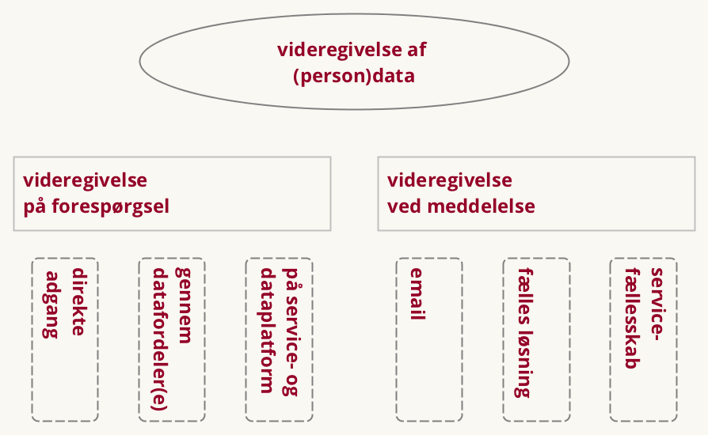

Version 0.1, september 2017. Arbejdsdokument, der bygger oven på en tidligere udarbejdet Synopsis for Referencearkitektur for deling af data og dokumenter, august 2017. Benyttet i workshop med arkitektarbejdsgruppen under SDA.

Version 0.2, primo oktober 2017. Arbejdsdokument benyttet i forbindelse med anden workshop med arkitektarbejdsgruppen under SDA.

Version 0.3, medio oktober 2017. Opdateret med input fra anden workshop. Udgør Delleverance 2 ift. projektet Referencearkitektur for deling af data og dokumenter.

Version 0.4, november 2017. Til intern brug i KDA.

**Version 0.5, december 2017. Til kommentering hos arbejdsgruppedeltagere og deres bagland**

*Version 0.7, forventet januar 2018. Til offentlig kommentering*

*Version 1.0, forventet marts 2018. Til vurdering hos Styregruppe for Data og Arkitektur*

# Resume
Hverdagen er digital, og data om borgere, virksomheder, myndigheder, ejendomme, steder, køretøjer m.m. vedligeholdes på en lang række områder af den offentlige administration. Der ligger et stort potentiale i at gøre sådanne data tilgængelige for genbrug, så de kan skabe værdi i flere sammenhænge. Deling af data er et fundament for langt bedre understøttelse af tværgående, offentlige services, og åbner for anvendelse af data i nye og innovative sammenhænge.

Men deling af data kan være teknisk kompliceret og i mange tilfælde omkostningstungt. Herudover er deling af data alid underlagt en række lovmæssige og organisatoriske krav, der synligt og til fulde skal opfyldes for at bevare borgeres og virksomheders tillid til datadeling i det offentlige Danmark. Begge udfordringer kan medføre øget kompleksitet i datadelingsløsningerne og er dermed blandt årsagerne til, at potentialet i deling og genbrug af data endnu ikke indfriet i det omfang, det er muligt.

Denne referencearkitekturs formål er at hjælpe med at indfri dette potentiale. Dette gøres ved at introducere en fælles beskrivelse af de begreber og sammenhænge, der er væsentlige for at forstå og arbejde med design og implementering af løsninger, der involverer deling af data og dokumenter. Dette sker både på det strategiske plan, hvor vision, mål og arkitektoniske principper fastlægges; på det forretningsmæssige plan, hvor de typiske brugsscenarier beskrives; og på det tekniske plan, hvor en række implementeringsmønstre angiver, hvordan man i og mellem applikationer kan dele og forsende data. Endelig peger referencearkitekturen på en række konkrete specifikationer, der anvendes ved deling af data og dokumenter i dag i den offentlige sektor.

Referencearkitekturen er udarbejdet under Den fællesoffentlige digitaliseringsstrategi 2016-2020 og skal som sådan anvendes i alle projekter, der sorterer under digitaliseringsstrategien. Referencearkitekturen er dermed relevant for såvel offentlige myndigheder, deres leverandører samt for virksomheder, der ønsker at gøre brug af offentlige data.

# Introduktion

## Formål, anvendelse og målgruppe

Det overordnede formål med denne referencearkitektur er at understøtte offentlig digitalisering i regi af Den fællesoffentlige digitaliseringsstrategi 2016-2020. Derudover kan referencearkitekturen finde anvendelse generelt i projekter i såvel offentlige som private digitaliseringsinitiativer.

Specifikt i sammenhæng med udmøntningen af den aktuelle strategi skal referencearkitekturen anvendes:

- som reference i udarbejdelsen af løsningsbeskrivelser
- ved review af løsningsbeskrivelser
- til at danne et fælles sprog til at formulere en fælles handlingsplan blandt digitalieringsstrategiens parter

Samlet set skal referencearkitekturen bidrage til at skabe sammenhængende, sikre og effektive digitale services for borgere og virksomheder blandt andet gennem større genbrug af data samt ved at give mulighed for øget automatisering.

Dokumentet er primært målrettet it-arkitekter tilknyttet offentlige digitaliseringsprojekter, herunder enterprise-arkitekter, forretningsarkitekter og løsningsarkitekter, der har til opgave at kravspecificere og designe løsninger.

De første dele af dokumentet (Strategi og Forretningsmæssig arkitektur) henvender sig endvidere til projektledere og beslutningstagere, herunder forretningsansvarlige, digitaliseringschefer, it-chefer, afdelings- og kontorchefer og andre med rollen som systemejer.

Dokumentet i sin helhed er også relevant for nuværende og potentielle leverandører af offentlige it-løsninger.

## Scope

Referencearkitektur for deling af data og dokumenter understøtter design, udvikling og anvendelse af offentlige it-systemer, der videregiver eller modtager registrerede oplysninger i elektronisk form til/fra andre myndigheder, virksomheder og borgere.

Referencearkitekturen skrives på baggrund af Den fællesoffentlige digitaliseringsstrategi 2016-2020 under initiativ 8.1 med tilslutning fra
FM, UFM, EVM, SIM, JM, EFKM, MBUL, SÆM, SKM, MFVM, BM, KL og Danske Regioner. Heri beskrives referencearkitekturen således:

> For at operationalisere, hvilke krav hvidbogen konkret stiller til initiativer og systemer udarbejdes en referencearkitektur for deling af data og dokumenter, der blandt andet beskriver fælles behovsmønstre og mønstre for teknisk understøttelse, herunder de forskelige roller, der skal afklares i initiativerne. Referencearkitekturen udpeger også eventuelle områder for eksisterende og nye fælles standarder og infrastruktur, som skal lette initiativernes implementering. Referencearkitekturen bliver således en generel ramme og støtte for alle initiativernes egen specifikke arkitektur.

I et juridisk perspektiv er dette område reguleret af en lang række forordninger og love. De mest relevante specielt med hensyn til videregivelse af persondata er:

- **EU-persondataforordningen (GDPR)** beskriver pligter og rettigheder ved behandling af persondata. I sammenhæng med denne referencearkitektur er GDPR fundamentalt relevant, da en stor del af de data, der er registreret af offentlige myndigheder, netop er personhenførbare. Da persondata er en af de datatyper, der er strengest reguleret (sammenlignet med fx virksomhedsdata, geodata, registrering af objekter m.m.), har vi valgt at genbruge mange termer og begreber fra netop GDPR i denne referencearkitektur. Herudover er en række aspekter, der dækkes af GDPR, relevante - fx definitionen af gyldige grunde til datadeling, den nødvendige hjemmel i form af borgeren (den registreredes) samtykke, og meget mere. GDPR er således nødvendig læsning for enhver, der planlægger at genbruge persondata i offentlige sagsgange, selvbetjeningsløsninger m.v.

- **Persondataloven** beskriver pligter og rettigheder ved behandling af persondata. Relevansen for denne referencearkitektur er i høj grad den samme som for GDPR. Det bemærkes, at Persondataloven forventes helt eller delvist erstattet af en kommende Databeskyttelseslov, der på tidspunktet for dette dokuments udarbejdelse behandles i folketinget, og som sammen med GDPR fremover vil definere den registreredes rettigheder.

Med hensyn til digitalisering generelt er følgende love særligt relevante:

- **EU-forordningen eIDAS** (electronic IDentification, Authentication and trust Services) definerer registrerede tillidstjenester. Forordningen specificerer bl.a., at elektroniske transaktioner, der opfylder kravene i eIDAS, altid har samme juridiske gyldighed som klassiske, papirbårne transaktioner. Forordningen fjerner dermed en klassisk barriere for digitalisering. I forhold til denne referencearkitektur bemærker vi, at eIDAS har et udpræget grænseoverskridende (*cross border*) fokus. Det grænseoverskridende aspekt af datadeling behandles ikke i dette dokument.

- **Lov om Digital Post fra offentlige afsendere** gør det obligatorisk for virksomheder og borgere at modtage digitale meddelelser fra offentlige afsendere. Digital Post er således en helt fundamental kanal, når myndigheder ønsker at dele data og dokumenter med borgere og virksomheder gennem meddelelser.

Derudover er der en række mere specifikke love, der sætter rammer for datadeling i den offentlige forvaltning, fx inden for særlige sektorer eller domæner. Listen nedenfor inkluderer de væsentligste, men forsøger i øvrigt ikke på at være udtømmende.

- **Sundhedsloven** regulerer hvem der har ansvar for behandling, forebyggelse og sundhedsfremme i det danske sundhedsvæsen. Sundhedsdata om borgere udgør en særlig følsom kategori af data, og Sundhedsloven regulerer derfor i detaljer, hvordan og til hvilke formål data kan behandles. Hvem, der har adgang til data, og hvordan adgang kan begrænses (herunder 'negativt samtykke', der i nogen grad svarer til GDPR-begrebet 'begrænsning af behandling'), er ligeledes reguleret med relativt finkornet granularitet.

- **Serviceloven** udstikker rammerne for rådgivning og støtte for at forebygge sociale problemer samt for at tilbyde ydelser til borgere med nedsat fysisk eller psykisk funktionsevne eller særlige sociale problemer. Loven danner baggrund for sagsbehandlingsforløb, der typisk kan involvere en række forskellige myndigheder. Dermed er loven et godt eksempel på, hvordan der juridisk kan gives hjemmel til deling/videregivelse af data i en række, konkrete scenarier.

- **Forvaltningslov** indeholder regler om borgernes retsstilling over for den offentlige forvaltning. I forbindelse med sagsbehandling i offentlige forvaltninger regulerer loven bl.a. aktindsigt fx i begrundelse for afgørelser. I forhold til denne referencearkitektur spiller Forvaltningsloven bl.a. ind i diskussionen om forholdet mellem data og dokumenter.

Scope for denne referencearkitektur er, som navnet angiver, selve delingen/videregivelsen af data (herunder persondata og evt. i form af dokumenter). Vi søger ikke at definere *anvendelsen* af data, herunder hvordan data registreres, eller hvordan den aktør (fx en myndighed), der afsender eller modtager data, benytter disse data i en konkret arbejdsgang. Processerne for registrering samt afsendelse og modtagelse af en meddelsese er dog summarisk beskrevet for at introducere begreber, der er relevante for at kunne tale om selve delingen/videregivelsen af data.

Specifikt er det uden for scope af denne referencearkitektur at definere:

* Anvendelse af data, herunder:
     * Registrering og intern anvendelse af data hos den dataansvarlige myndighed
     * Konteksten for en aktørs behov for at forespørge på data, videregive data via en meddelelse eller modtage data via en meddelelse
* Streaming af data (videodata, IoT-data m.m.)
* Grænseoverskridende (cross-border) datadeling

I forhold til streaming af data bemærkes det, at streaming løseligt kan beskrives som en seriel række af processen `videregivelse på forespørgsel`, som vi beskriver senere i dette dokument. Eventuelle, yderligere aspekter ved streaming, der kan være relevante at dykke ned i i referencearkitektursammenhæng, er ikke inkluderet i denne referencearkitektur, men må henvises til en specialiseret referencearkitektur for streaming af data.

I forhold til grænseoverskridende datadeling er mandatet for denne referencearkitektur begrænset til bestemte initiativer forankret hos de myndigheder, der er del af Den fællesoffentlige digitaliseringsstrategi 2016-2020. Mandatet inkluderer ikke myndigheder i andre lande, hvorfor en beskrivelse af grænseoverskridende datadeling aldrig vil kunne blive fyldestgørende.

## Centrale begreber
Trods det, at Data, Oplysninger og Informationer er tæt relaterede begreber, er deres umiddelbare forståelse meget forskellig på tværs af faggrupper og praksisser.

Vi vil i denne referencearkitektur holde os fra at komme med en længere, fænomænologisk udredning af forskelle og ligheder mellem disse termer. I stedet vil vi fokusere på en mere pragmatisk og lokal definition og holde os til `data` som generelt begreb.

### Data og dokumenter

Figuren viser de centrale begreber i denne referencearkitektur, hvor `data` ikke overraskende ligger i midten. Vi vil dog ikke introducere en specifik og isoleret definition af `data` - vi regner med, at læseren har en god fornemmelse for, hvad `data` er, og det er i denne sammenhæng tilstrækkeligt.

Vi vil i stedet tale om `data` ud fra de relationer, der er afbildet i figuren. Har man fx mange, ens strukturerede `data` samlet samme sted, indgår `data` i en `samling`. En `samling` vil typisk have en standardiseret måde, hvorpå man kan hente `data` på forespørgsel.

`Data` kan også indgå i en `meddelelse` i forbindelse med, at det videregives fra en afsender til en modtager. En `meddelelse` kan være både struktureret og ustruktureret.

`Data` har to specialiseringer. Den første er en `registrering`, der betegner, at en myndighed har registreret oplysninger på standardiseret og struktureret vis, typisk ud fra specifik, lovmæssig hjemmel. `Registreringerne` udgør tilsammen et `register`, der dermed er en specialiseret `samling`. `Registeret` understøtter opslag af `data` i form af den oprindelige `registrering`, fx i kontekst af myndigheders sagsbehandling eller for at understøtte selvbetjeningsprocesser. `Registeret` kan også understøtte mere finkornede opslag. Et eksempel på dette kunne være en anvendelsesorienteret dataservice, der baserer sig på finkornede opslag i flere registre for at kombinere udvalgte data til brug i en given, specifik sammenhæng.

Den anden specialisering af `data` er i form af et `dokument`. Med denne modellering viser vi, at et `dokument` i bund og grund blot består af `data`. Som afledt konsekvens vælger vi som generelt pricip i denne referencearkitektur ikke tale om deling af "`data` og `dokumenter`", men i stedet indskrænke til at tale om "`data`".

Med det sagt, er der alligevel nogle kvaliteter ved et `dokument`, der skal fremhæves. For det første er et `dokument` typisk karakteriseret ved, at det er er optimeret mod at være tilgængeligt for menneskeøjne, da det binder `data` i en grafisk, læsbar opsætning (i tilgift til, at mange dokumenttyper også tilbyder indlejring af data i fuldt struktureret, maskinlæsbar form). For det andet har et `dokument` nogle iboende egenskaber, der er hensigtsmæssige i forvaltningsmæssige sammenhænge: Et `dokument` kan samle en række `data`, der i praksis håndteres som en samlet enhed, eller som er nødvendige på et givet tidspunkt i et sagsbehandlingsforløb, for eksempel som beslutningsgrundlag eller ved videregivelse af `data` fra én myndighed til en anden. Et `dokument` kan være tidsstemplet og signeret, og er dermed en klart grundlag for aktindsigt, retslige afgørelser og i det hele taget den historiske dokumentation af en sagsgang. Til sammenligning vil det ofte være vanskeligere at afgøre, nøjagtigt hvordan en specifik `registrering` så ud i et `register` på et givet tidspunkt. Dette vil typisk kræve, at `registeret` på forespørgselstidspunktet teknisk gendanner, hvordan `registreringen` så ud på det givne tidspunkt - hvorimod de historiske `data`, hvis de var gemt i `dokument`-form, ville være direkte tilgængelige.

Sluttelig findes der også en specialisering af `samling` for `dokumenter`, nemlig et `repository`, som er det fysiske sted, hvor `dokumenter` lagres efter oprettelse, og hvorfra de hentes ved efterfølgende anvendelse. Vi anvender den engelske term `repository` jf. Referencearkitektur for deling af dokumenter og billeder, 2012.

Endvidere vil vi undlade at bruge ordet `metadata`. Ordet anvendes historisk set meget forskelligt, typisk med en betydning der er tæt knyttet til en konkret anvendelsessituation. Fra denne referencearkitekturs synspunkt er `metadata` imidlertid blot en særlig form af `data`.

To virkelige eksempler kan benyttes til at gøre begreberne omkring `data` konkrete:

- **CPR-registeret**: `data` om borgere indgår i den `datasamling`, der kaldes CPR-registeret og i praksis benævnes netop som et `register`. `Data` om en enkelt borger udgør én specifik `registrering` i CPR-registeret, der kan hentes via en standardiseret forespørgsel.
- **Røntgenbilleder**: `data` om et røntgenbillede består dels af billeddata, dels af yderligere informationer som fx tidsstempel, patient-ID, datakilde m.m. I praksis håndteres `data` om et røntgenbillede i et samlet, standardiseret objekt, som vi kan refere til som et `dokument`. Røntgenbilleder er gemt i `samlinger`, der for `dokumenter` kaldes et `repository`, og som i praksis ligger decentralt i røntgensystemer hos de enkelte regioner/hospitaler.

### Grundlæggende mønstre
Et af hovedformålene med denne referencearkitektur er at vejlede i valget mellem de to grundlæggende, generiske procesmønstre for videregivelse af data:

 - `Videregivelse på forespørgsel` - typisk via et API i system til system-integrationer
 - `Videregivelse ved meddelelse` indeholdende `data` (herunder `dokumenter`) - typisk brugt ved beskeder til borgere/virksomheder, der skal have retsvirkning, men også et klassisk mønster brugt i system til system-integrationer.

Den fundamentale forskel på disse to scenarier er, om det er den aktør, der *videregiver* data eller den aktør, der *modtager* data, der kender den konkrete kontekst for, hvordan data skal anvendes.

Ved `videregivelse på forespørgsel` er dataafsenderen som udgangspunkt ikke bekendt med datamodtagerens formål (men er naturligvis forpligtet til at håndhæve relevant hjemmel). Et eksempel på dette er en myndigheds forespørgsel på personoplysninger i CPR-registeret.

Ved `videregivelse ved meddelelse` er det dataafsenderen, der i en given kontekst afsender en meddelelse med et givent formål - typisk som led i en afviklingen af en arbejdsgang, der enten kan være manuel eller automatiseret. Et eksempel på dette er politiets fremsendelse af en fartbøde til en borger.

Figuren nedenfor opsummerer nogle af denne referencearkitekturs væsentligste elementer. Dokumentets overordnede emne er `videregivelse af data`, herunder persondata. De to grundlæggende måder at videregive data på er enten på forespørgsel eller gennem en meddelelse - afsnittet "Forretningsarkitektur" beskriver de to scenarier i yderligere detaljer. For hvert scenarie er der en række, mulige implementeringsmønstre - disse behandles nærmere i afsnittet "Teknisk arkitektur".

## Tilblivelse og governance
Første udgave er skrevet hos Kontor for Data og Arkitektur af Mads Hjorth, Digitaliseringsstyrelsen og Anders Fausbøll, Omnium Improvement.

I udarbejdelsen har en arbejdsgruppe af offentlige arkitekter bidraget gennem en række af workshops. I gruppen har deltaget: [TODO: Oplist deltagere i arbejdsgruppe]

Endelig godkendelse forventes hos Styregruppe for Data og Arkitektur under Digitaliseringsstrategien 5. marts 2018. Herefter vil Styregruppen eje dokumentet, med Kontor for Data og Arkitektur som ansvarlig for vedligehold af referencearkitekturen frem til 2020 som en del af den Fællesoffentlige, Digitale Arkitektur.

Metodemæssigt er referencearkitekturen udarbejdet inden for rammerne af [Fællesoffentlig Digital Arkitektur](https://arkitektur.digst.dk/) og følger så vidt muligt den fælles skabelon for referencearkitekturer som udarbejdet i Sekretariatet for Styregruppen for Data og Arkitektur under digitaliseringsstrategien. Metoderammen bygger blandt andet på erfaringer fra OIO referencearkitektur, og indarbejder også elementer fra European Interoperability Reference Architecture (EIRA), The Open Group Architecture Framework (TOGAF), ArchiMate m.m.

Denne referencearkitektur relaterer sig til en række andre referencearkitekturer, både eksisterende og planlagte. Specifikt gør denne referencearkitektur brug af:

- Fællesoffentlig referencearkitektur for brugerstyring - [link til version 1.0](https://www.digst.dk/Arkitektur-og-data/It-arkitektur/Brugerstyring)

Den skal kunne anvendes af:

- Fællesoffentlig referencearkitektur for selvbetjening (under udarbejdelse i regi af Initiativ 1.2 af Den fællesoffentlige digitaliseringsstrategi 2016-2020)
- Fællesoffentlig referencearkitektur for overblik over egne sager og ydelser (under udarbejdelse i regi af Initiativ 1.3 af Den fællesoffentlige digitaliseringsstrategi 2016-2020)

... og skal anvendes i kontekst sammen med:

- Referencearkitektur for sags- og dokumentområdet (OIO, 2008) - [link](https://digitaliser.dk/resource/230688)
- Referencearkitektur for deling af dokumenter og billeder (National sundheds-it, 2012) - [link](https://sundhedsdatastyrelsen.dk/da/rammer-og-retningslinjer/om-referencearkitektur-og-standarder)
- Referencearkitektur for informationssikkerhed (National sundheds-it, 2013) - [link](https://sundhedsdatastyrelsen.dk/da/rammer-og-retningslinjer/om-referencearkitektur-og-standarder)
- Indberetning til registre på sundhedsområdet (under godkendelse pr. november 2017)

[TODO: Tilføj publicering & relaterede dokumenter]

## Signaturforklaring
I dokumentet er specifikke termer/ord fremhævet med en særlig `skrifttype` for at markere referencer til elementer på figurer (og vedlagte Archimate-model).
Andre termer/ord i teksten er fremhævet med *kursiv*, hvilket markerer at elementet findes i Archimate-begrebsapparatet.
[TODO: Afklari hvor høj grad vi kan henvise til/benytte FDAs dokumentationsramme]

Det bemærkes, at prefixet 'data-' kan være udeladt på begreber/elementer i tekst og figurer fx af formatterings- eller læsbarhedshensyn uden, at der ligger en indholdsmæssig skelnen bag (fx `dataanvendelse`/`anvendelse`, `datasamling`/`samling` o.a.)

I forhold til ejerskab af de elementer, der indgår i dokumentets figurer og tekst, markerer:

- **Fed tekst** (i rød): At et element eller en relation ejes og defineres i denne referencearkitektur.
- Almindelig tekst (i blå): At et element eller en relation ejes og defineres et andet, nærmere angivet sted, fx i andre referencearkitektur eller i lovgivning.
- _Kursiv:_ At et element eller en relation ikke er nærmere defineret i denne referencearkitektur.

I elementerne i dokumentets figurer angiver:

- runde hjørner: et Procestrin (*Business Functions*)
- skarpe hjørner: en Applikationsservice (*Application services*)
- "slikkepind": en Snitflade (*Application Interface*)

# Strategi
Dette afsnit introducerer visionen for deling af data og dokumenter med baggrund i identificerede temaer, principper, arkitekturregler og den forventede værdiskabelse.

## Temaer
Referencearkitekturen udmønter og understøtter beslutninger i Den fællesoffentlige digitaliseringsstrategi 2016-2020. Desuden er der i udarbejdelsen taget hensyn til en række aktuelle, offentlige/politiske strategier, herunder Sammenhængsreformen, Cybersikkerhedsinitativet, kommunernes digitaliseringsstrategi "Lokal og Digital", samt det europæiske rammeværk for interoperabilitet (New European Interoperability Framework for European Public Services).

Der kan på tværs af strategierne identificeres en række forretningsmæssige og teknologiske temaer, som ligeledes har bidraget til at sætte retningen for den ønskelige arkitektur.

- **Sammenhængende offentlige services** er det mest tydelige, gennemgående tema på tværs af strategierne. Den offentlige forvaltning ønsker at tilbyde borgere og virksomheder services, der ikke er tæt knyttet til enkelte myndigheder, men opleves som sammenhængende for dem, der anvender servicen. Mest tydeligt er det udtrykt i European Interoperability Frameworks koncept om *integrated service delivery*, men temaet er også meget fremtrædende i regeringens sammenhængsreform.

- **Suverænitet og beskyttelse mod cyberangreb** er et tema, som har været på dagsordenen længe, men har med regeringens cybersecurity-strategi fået en vægt og et fokus, der ikke er set tidligere. Tendensen udgør et større, strategisk skifte, som flytter noget af den tillid, som tidligere har været vist store it-leverandører, og peger i retning af hjemtagning af centrale/kritiske/vitale funktioner som fx netværk.

- **Øget opmærksomhed om behandling af personlige oplysninger** Den europæiske forordning om beskyttelse af personoplysninger (GPDR) og tilhørende dansk implementering udvider den dataansvarliges risiko i forhold til tidligere. Det har ført til et fornyet fokus på at have styr på behandling af persondata og tilsynet hermed.

- **Grænseoverskridende services** I takt med, at de enkelte nationer udvider deres ambitioner for offentlig, digital service til borgere og virksomheder, stiger også behover for at koordinere arkitektur og it-løsninger på tværs af landegrænser for dels at understøtte services, der i deres natur krydser grænser (fx arbejde eller ejerskab af fast ejendom i et andet land), men også for at standardisere og dermed undgå opbygning af nationale "siloer". EU er en aktiv spiller i at drive denne standardisering gennem initiativer som EIF og EIRA samt forordninger som GDPR, eIDAS m.fl.

- **Scale-out af løsninger til web scale** Der har de sidste 5-10 år været fokus på at få teknologier til at skalere forudsigeligt til *web scale*. Der har voldsomt udvidet de ressourcer, der globalt er blevet brugt på large-scale implementeringer. Nu er området så modent, at teknologierne også er tilgængelige for projekter på national skala og endda i enkeltprojekter.

- **Microservices** En måde at håndtere den stigende kompleksitet i forvaltningen af it-landskaber er en udbredt strategi om at levere applikationer i mindre enheder. *Microservices* er en sådan strategi.

- **Nær realtid** - med henblik på automatisering og sammenhængende services er der fokus på at have kortest mulig tid mellem registrering og anvendelse af data. Det medfører behov for færre batch-overførsler. Selvbetjeningsservices bygges, så de kan gennemføres i 'one-seating'.

## Strategiske principper
De strategiske principper, der ligger til grund for denne referencearkitektur, udspænder sig i et spændingsfelt. På den ene side åbner visionen om det datadrevne samfund, hvor data ses som et råstof for samfundsudviklingen, for en lang række muligheder og ønsker. På den anden side er deling og data også underlagt begrænsninger og indskrænkninger i lovgivning. Dette afsnit opridser de væsentligste principper i dette spændingsfelt.

På mulighedssiden er det en fundamental målsætning, at:

> *Det digitale skal være let, hurtigt og sikre god kvalitet* (kilde: Digitaliseringsstrategien)

Mere generisk kan man, med inspiration fra the European Interoperability Framework (EIF - https://ec.europa.eu/isa2/eif_en), fremhæve fire overordnede principper:

Interoperabilitet
  ~  *princip* om sammenhængende services og smidige brugerrejser på tværs af myndighedsskel

Once-only
  ~  *princip* om, at borger og virksomhed kun skal afgive den samme information til det offentlige én gang.

Gennemsigtighed
  ~ *princip* om, at borgere og virksomheder får øget indsigt i, hvilke oplysninger der er registreret om dem hos hvilke offentlige myndigheder, hvem der anvender disse og til hvilke formål

Genbrug
  ~ *princip* om genbrug af it med henblik på lavere omkostninger

På begrænsningssiden er der også en række principper, der skal tages i agt. Nedenstående principper er hentet fra EUs persondataforordning (GDPR) og er i vores sammenhæng dækkende uden behov for yderligere definition:

- *lovlighed, rimelighed og gennemsigtighed*
- *formålsbegrænsning* (undtaget er arkiver, forskning og statistiske formål)
- *data-minimering*
- *rigtighed* (urigtige data skal straks slettes eller berigtiges)
- *opbevaringsbegrænsning* (data må ikke opbevares "for evigt")
- *integritet og fortrolighed*
- *ansvarlighed* (man skal kunne påvise, at ovenstående overholdes)

## Vision
Visionen i denne referencearkitektur er at stræbe efter en situation, hvor:

> *Data er en fælles, værdifuld og velbeskyttet ressource, som er nem at dele og bruge, men svær at misbruge*

**Fælles** betyder, at data i videst muligt omfang betragtes som et fælles gode på tværs af myndigheder ud fra en betragtning om, at data, der registreres ét sted til ét formål, kan have stor værdi for andre myndigheder og virksomheder, der udbyder private tjenester. **Værdifuld** betyder, at data, der er registeret i det offentlige, betragtes som et økonomisk og kvalitetsmæssigt aktiv på lige fod med kontantbeholdninger og fysiske bygninger. **Velbeskyttet** betyder, at der er taget tilstrækkelige og effektive sikkerhedsmæssige tiltag for at beskytte borgere og virksomhederes tillid til, at opbevaring, anvendelse og videregivelse sker under gennemskuelige og retmæssige forhold. **Nem at dele** betyder, at udgifterne ved at anvende data i en ny sammenhæng ikke alene løftes af den dataansvarlige myndighed, samt at der er tydelig vejledning i udarbejdelse af nødvendige aftaler, og at processen ikke tager for lang tid. **Nem at bruge** betyder, at der er fastlagte processer, *best practices* og generiske infrastrukturelementer, der kan genbruges. **Svær at misbruge** betyder, at enkeltpersoner, organisationer og fremmede magter, der måtte have til hensigt at bruge data uretmæssigt, begrænses mest muligt gennem en indsats, der står i forhold til truslerne og de mulige konsekvenser af misbrug.

Denne vision kræver, at en række forretningsevner *(capabilities)* i det offentlige forstærkes væsentligt, herunder:

- **Koordination af lovgivning** - handler ikke kun om digitaliseringsparat lovgivning, men også om at der er enighed om centrale definitioner på tværs af flere ressortområder. Samt, at der er adgang til effektiv vejledning de steder, hvor der måtte være modstrid.

- **Aftaleindgåelse** kan tage lang tid og kræver meget arbejde. Bør kunne ske på baggrund af mere generelle og eksisterende aftaler, så vi ikke starter forfra, hver gang nye videregivelser skal etableres.

- **Identifikation og dokumentation af data** - sker allerede i ISO 27000-sammenhæng for den interne brug, men også behov for at dække, at data udstilles til andre.

- **Genbrug af løsninger** - sikrer, at vi kan lave hyppige udvidelser både af funktionalitet og anvendelsesområde.

## Værdiskabelse
Værdien ved at følge denne referencearkitektur er, at den understøtter:

- enklere og mere effektive digitale services for borgere og virksomheder
- simplere arbejdsgange og mere potentiale for automatisering hos organisationer (myndigheder/virksomheder)
- vækst gennem nye typer af services baseret på eksisterende data
- øget transparens og bevarelse af tillid til registre
- effektiv systemudvikling (begrænser udfaldsrum, opsamler best practice)
- juridisk værdi gennem design-mæssig indlejring af compliance-understøttelse for GDPR, eIDAS m.m.
[TODO: Dette afsnit skal strammes op. Overvej at binde værdi op på de strategiske målsætninger. Overvej at adskille i direkte og indirekte værdiskabelse]

## Fællesoffentlige arkitekturprincipper og -regler

Den Fællesoffentlige Digitale Arkitektur (FDA) udpeger en række principper til rammesætning og styring af den offentlige digitalisering. Under hvert princip angiver FDA fra 1 til 5 konkrete arkitekturregler. Tabellen nedenfor gengiver FDA's arkitekturprincipper (kilde: https://arkitektur.digst.dk/).

Nr. | Område        | Princip
--- | ------------- | ------
1   | Styring       | Arkitektur styres på rette niveau efter fælles rammer
2   | Strategi      | Arkitektur fremmer sammenhæng, innovation og effektivitet
3   | Jura          | Arkitektur og regulering understøtter hinanden
4   | Sikkerhed     | Sikkerhed, privatliv og tillid sikres
5   | Opgaver       | Processer optimeres på tværs
**6**   | **Information**   | **Gode data deles og genbruges**
7   | Applikation   | It-løsninger samarbejder effektivt
8   | Infrastruktur | Data og services leveres driftssikkert

I denne referencearkitektur er fokus at understøtte arkitekturprincip 6 om, at *Gode data deles og genbruges* og i særlig grad den underliggende regel: *6.1 Del og genbrug data*. Referencearkitekturen for deling af data og dokumenter tilbyder to måder, hvorpå data kan videregives til genbrug, og seks forskellige, tekniske implementeringsmønstre, som videregivelse/deling af data kan realiseres gennem.

Derudover er en række af de øvrige arkitekturregler rammesættende for dette arbejde:

*AR 1.2 Optimer arkitektur efter projektets og de fælles mål*

- Udgifter i datadeling skal fordeles. Hvis byrden i datadeling begrænser genbrug, bør den afløftes fra dataansvarlig

*AR2.5 Stil data og løsninger til rådighed for private*

- Fælles metoder for datadeling understøtter sammenstilling af data og tværgående brug blandt myndigheder og virksomheder

*AR3.1 Tag højde for juridiske bindinger i forhold til deling og genbrug af data og it-systemer*

- Dataudveksling mellem organisationer designes ud fra en "dokument-tankegang" (aht. journalisering, forvaltningsret, tvistafgørelse, indsigter m.m.)
- Modeller funderes (med eksplicitte referencer) i relevant lovgivning nationalt og internationalt

*AR4.1 Opfyld krav til informationssikkerhed og privatlivsbeskyttelse*

- Understøtte borgeres og virksomheders indsigt i opbevaring og anvendelse af følsom data
- Beskrivelse af, adgang til og anvendelse af data sker under klar governance og håndhæves ud fra tydelig hjemmel
- Begræns eksistens og anvendelse af kopiregistre mest muligt

*AR4.2 Anvend fælles arkitektur for informationssikkerhed*

- Ansvar for begrænsning af adgang ligger hos dataansvarlig (typisk identisk med registerejer)
- Vedlighold af fuldmagter og samtykker sker løst koblet fra deres håndhævelse

*AR5.1 Optimér tværgående processer efter fælles mål*

- Data beskrives, fordeles, forbedres og beskyttes i fællesskab

*AR6.2 Anvende fælles regler for dokumentation af data*

- Anvend fælles referenceinformationsmodel, grund- og referencedata

# Forretningsarkitektur
Dette afsnit beskriver på forretningsniveau de centrale forretningsfunktioner, der er dækket i denne referencearkitektur, i form af use cases og tværgående processer. De medvirkende aktører og deres roller beskrives. Sluttelig gives en oversigt over de forretningsobjekter, der er i spil omkring deling af data og dokumenter.

## Forretningsmæssig kontekst for datadeling
Emnet for denne referencearkitektur er "deling af data og dokumenter". Det er ikke urimeligt at sige, at denne funktion er så generisk, at det indgår i snart sagt alle processer, der går ud over den enkelte myndighed, hvad enten det er i forbindelse med sagsbehandling, selvbetjening eller noget tredje. Overordnet set finder referencearkitekturen dermed anvendelse i løsningen af alle offentlige opgaver.

Som beskrevet i afsnit 1 har vi præciseret scope for dette dokument til at dreje sig om selve *delingen* af data - og ikke de mulige *anvendelser*, der muliggøres gennem delingen. Vi gør dette ud fra en betragtning om, at typen af denne referencearkitektur er en grundlæggende referencearkitektur. Når det er sagt, er det alligevel meningsfuldt kort at overveje de typiske anvendelser for derigennem at forstå konteksten for datadeling bedre.

Figuren ovenfor illustrerer, at anvendelsen af delte data kan deles ind i to kategorier: Den primære anvendelse, som består af behandling af data i forbindelse med en sagsgang, som oftest vil være det formål, data er indsamlet til. Primære anvendelser er typisk knyttet til sagsbehandling, borgerens/virksomhedens selvbetjening eller til forskellige, private tjenester, der gør brug af delte data.

Herudover findes der sekundære anvendelser, som indbefatter brug af data til styringsformål, økonomiopfølgning og økonomisk afregning, statistik, forskningsformål og meget mere.

 Som eksempler på anvendelser, der vil have gavn af effektiv datadeling, kan nævnes nedenstående sæt af generiske procesmønstre:

- Myndigheders sagsbehandling (beskrevet i Referencearkitektur for Sag og dokument)
- Selvbetjening, vendt mod borgere og virksomheder (beskrevet i Referencearkitektur for Selvbetjening)
- Indsigt i oplysninger og deres anvendelse (fra Referencearkitektur for Overblik over sag og ydelser)
- Brug af Digital Post (herunder påmindelser)
- Brug af abonnementsfunktionalitet (herunder tilmelding)
- Medbringelse af et dokument til en anden, offentlig/privat serviceudbyder, der ikke har adgang til registre - herunder bekræftelse af dokumentets ægthed og validering af dets indhold
- Tværgående analyse, tilsyn og kontrol

## Forretningsfunktionen deling/videregivelse
Hvis vi zoomer ind på selve delingen - eller `videregivelsen`, som vi vil præcisere til for at fremhæve den faktiske delingshandling og ikke blot det, at data er potentielt tilgængeligt - kredser referencearkitekturen om én central og to relaterede, delte _use cases_, hvor aktører arbejder sammen i forskellige roller.

De tre use cases er:

videregivelse
  ~ *collaboration* hvor oplysninger opbevaret hos én aktør videregives til en anden

registrering
  ~ *collaboration* hvor oplysninger bringes på digital form

sletning og arkivering
  ~ *collaboration* hvor oplysninger slettes eller videregives til arkivering

## Forretningsroller og aktører

I ovenstående use cases indgår disse forretningsroller:

den registrerede
  ~ den person (datasubjekt), som oplysningerne vedrører (*rolle* fra GDPR)

dataanvender
  ~ en fysisk eller juridisk person, en offentlig myndighed, en institution eller et andet organ, der behandler personoplysninger på den dataansvarliges vegne (*rolle* fra GDPR)

dataansvarlig
  ~ en fysisk eller juridisk person, en offentlig myndighed, en institution eller et andet organ, der alene eller sammen med andre afgør, til hvilke formål og med hvilke hjælpemidler der må foretages behandling af personoplysninger (*rolle* fra GDPR)

registrant
  ~ *rolle* som bringer oplysninger på digital form, registrer

Som tidligere tager vi udgangspunkt i, at det er persondata, der behandles. Der findes imidlertid mange typer af data, der ikke er personhenførbare. I et sådant tilfælde falder `den registrerede` væk fra ovenstående billede, sammen med de GDPR-relaterede handlinger `ret`, `begræns anvendelse` og `få indsigt`.

De aktører, der er i spil omkring deling af data og dokumenter, er:

1. **Offentlige myndigheder** (herunder virksomheder, der handler på vegne af offentlige myndigheder). Kan typisk være `dataansvarlig` eller `dataanvender`, men også ofte agere som `registrant`.
2. **Borgere** - oftest i rollen som `den registrerede`, men også som `registrant`.
3. **Virksomheder** som `dataanvendere`, særligt i forbindelse med private tjenester, der anvender oplysninger registreret i offentligt regi i forbindelse med at levere ydelser til `den registrerede`, men også, når anvendelsen er for virksomhedens egen skyld.

## Tværgående processer
I ovenstående diagram over centrale use cases er `videregivelse` den væsentligste, da den rummer selve delingen af data. Dykker man ned i den, findes den i to grundvarianter, hhv. `videregivelse på forespørgsel` og `videregivelse ved meddelelse`. Figuren nedenfor beskriver disse to varianter på procesform og knytter dem tillige sammen med en kort beskrivelse af processen `registrering af data`.

Nedenfor er de to grundvarianter for datadeling, `videregivelse på forespørgsel` og `videregivelse ved meddelelse`, beskrevet i detaljer. `Registrering af data` er ligeledes beskrevet, dog mere summarisk, da den i kontekst af denne referencearkitektur kun er med af referencehensyn.

### Videregivelse på forespørgsel

Denne proces dækker, at en `dataanvender` - typisk en myndighed, men kan også være en virksomhed - søger adgang til data, der på forhånd er gjort tilgængelige af en `dataansvarlig`. De indgående procestrin er:

behov opstår
  ~ *begivenhed* hvor en `dataanvender` har brug at anvende data, der opbevares af en `dataansvarlig`

Processen starter hos `dataanvender`, der har identificeret et behov for at indhente data. Dette behov opstår typisk i kontekst af andre processer, som vi ikke specificerer nærmere her, men som indbefatter sagsbehandling, selvbetjeningsløsninger, analyser og meget mere.

forespørg om data
  ~ *procestrin* hvor en `dataanvender` spørger om udstillede data

`Dataanvender` sender en forespørgsel på data, der beskriver, hvilke data der ønskes. Ved adgang til andet end åbne data skal den nødvendige hjemmel ligeledes fremgå af forespørgslen, så `dataansvarlig` kan håndhæve den nødvendige adgangskontrol. Forespørgslen kan i praksis ske ved anvendelse af flere meddelelser, eksempelvis ved kriteriebaseret søgning forud for, at data hentes, eller ved at starte med en forespørgsel til et `indeks`, der udpeger relevante enkeltregistre, hvorfra data kan hentes.

vurder adgang
  ~ *procestrin* hvor det vurderes, om den etablerede adgangspolitik er overholdt.

`Dataansvarlig` myndighed vurderer i dette trin forespørgslen med henblik på at håndhæve adgangskontrol. Kun, hvis den medsendte hjemmel giver lovmæssig adgang til den forespurgte data, kan `dataansvarlig` gå videre med delingen. Hjemlen kan være eksplicit angivet eller ligge implicit i brugerstyringen. Hjemlen kan enten give generel adgang til en given `datasamling`, eller give adgang til specifik data i `samlingen`, hvorfor der i mange situationer vil være behov for at se på hjemlen og det efterspurgte data i sammnenhæng for at håndhæve adgangskontrollen. Et særligt aspekt i at vurdere adgang er håndhævelsen af 'negativt samtykke', hvor adgang til bestemte data er fjernet, fx fordi datas korrekthed er bragt i tvivl og skal undersøges. Dette procestrin kan i øvrigt benyttes af `dataansvarlig` til at håndhæve adgangskontrol også på andre planer som håndhævelse af en Service Level Agreement, beskyttelse mod misbrug, mistænkelig adfærd m.m. Det bemærkes endvidere, at `dataansvarlig` kan have overladt distributionsopgave og de praktiske opgaver for håndhævelse af adgangskontrollen til en `datadistributør`, hvilket i øvrigt ikke ændrer ved beskrivelsen af dette trin.

del data
  ~ *procestrin* hvor data videregives til andre

`Dataansvarlig` håndterer forespørgslen ved at slå data op i `datasamlingen`, evt. ved at sammenstille data fra flere `datasamlinger`, og sender et `svar` tilbage til `anvender`. Delingen af data bliver logget af `dataansvarlig`, indbefattende hvilken data, der blev delt; til hvilken `anvender`; og med hvilken hjemmel. Det bemærkes, at `dataansvarlig` ikke nødvendigvis er klar over, hvilket databehov forespørgslen har tjent til at tilfredsstille - så længe, adgangen er legitim og foretaget på baggrund af gyldig hjemmel, har `dataansvarlig` ikke behov for at kende til `dataanvenders` brug af data i den konkrete forespørgsel.

modtag svar
  ~ *procestrin* hvor meddelelser registreres i den modtagende organisation.

`Dataanvender` modtager svaret, der indeholder det efterspurgte data, fra `dataansvarlig.` `Dataanvenders` initielle behov for data er hermed opfyldt.

Når man skal vurdere processen `videregivelse på forespørgsel`, er følgende kvaliteter og kriterier de mest væsentlige at forholde sig til:

  * **Identifikation**: Det skal være muligt for både `dataansvarlig` og `dataanvender` at identificere hinanden entydigt og sikkert.
  * **Adgangskontrol**: Der skal være en effektiv adgangskontrol, der opfylder kravet til at kunne dokumentere en tydelig og nødvendig hjemmel med skyldig hensyntagen til effektivitet i løsningen
  * **Søgning**: `Dataansvarlig` bør tilbyde en søgefunktionalitet, der tillader `dataanvender` at fremsøge data effektivt på tværs af distribuerede, ensartede `datasamlinger` (fx røntgenbilledregistre), eller ud fra et sæt af kriterier.
  * **Sammenstilling**: `Dataansvarlig` kan, hvor det måtte være hensigtsmæssigt ift. specifikke behov, vælge at sammenstille data fra flere `datasamlinger` og udstille en service, der tilbyder det sammenstillede data.
  * **Indsigt**: Processen skal understøtte effektiv indsigt i anvendelse (logning)
  * **Opbevaring**: `Dataanvender` bør benytte den autoritative `datasamling` direkte hvis muligt. Herved undgås, at der opbygges 'skyggekopier' af `datasamlinger`, der introducerer kompleksistet i forbindelse med synkronisering, aktualitetsudfordringer m.m.

Det bemærkes, at processen for *use casen* `få indsigt`, hvor `den registrerede` benytter sig af sin ret til indsigt i, hvordan data om ham/hende er blevet anvendt, er et særtilfælde af `videregivelse på forespørgsel`. Den er derfor ikke beskrevet selvstændigt.

### Videregivelse ved meddelelse
Denne proces dækker, at en `afsender` - typisk en myndighed eller en virksomhed - har behov for at sende data (evt. i form af et dokument) til en `modtager`.

Generelt betragtet dækker `videregivelse ved meddelelse` både menneske til menneske-kommunikation (kommunikation til borgere/virksomheder, kommunikation mellem sagsbehandlere som led i en sagsgang m.v.), system til system-kommunikation (hvor `meddelelse`-mønsteret benyttes som ren teknisk integration), samt varianter, hvor enten afsendelsen eller modtagelsen af `meddelelsen` er automatiseret.

Til forskel fra `videregivelse på forespørgsel` starter denne proces hos `afsenderen` (der tillige kan være `dataansvarlig`). `Afsender` har udvalgt og pakketeret data i en meddelelse (evt. helt eller delvist i form af et dokument), adresserer meddelelsen (fx ved brug af et kontaktregister) og sender den herefter til `modtager`. `Modtager` kan være alle typer af aktører; for myndigheder og virksomheder bemærkes, at det i forbindelse med modtagelsen kan være relevant at fordele/route meddelelsen internt ud fra dens adresseringsoplysninger. I sammenligning med `videregivelse på forespørgsel` er det nu `afsender`, der som den part, der deler data, 'ejer' den fulde forretningskontekst - hvor den `dataansvarlige` ovenfor ikke var bekendt med formålet med at dele data.

behov opstår
  ~ *hændelse* hvor en `afsender` ønsker eller er pålagt at videregive data til en anden aktør.

Processen starter hos `afsender`, der - typisk i kontekst af en anden, overliggende proces - har behov for at dele data ved at sende en `meddelelse` til en `modtager`.

dan indhold af meddelelse
  ~ *procestrin* hvor afsender sammenstiller og formaterer data fra forskellige kilder til en `meddelelse`.

Første trin er, at `afsender` danner indholdet af meddelelsen. Indholdet kan være data under kontrol af `afsender` selv, men kan også indhentes fra andre via processen `videregivelse på forespørgsel` (der dermed bliver en underproces til `videregivelse ved meddelelse`, der i sig selv typisk også er en underproces).

adressér meddelelse
  ~ *procestrin* hvor afsender undersøger, hvordan meddelelsen kan sendes.

Dette trin giver mulighed for at angive en slutmodtager for `meddelelsen`, der kan være mere specifik end blot `modtager`. Som eksempel kan `modtager` i nogle tilfælde være en organisation, og der kan være behov for at specificere en bestemt ansat som slutmodtager, hvilket kan tilføjes som metadata til `meddelelsen`. En del af dette procestrin kan være at søge oplysninger i et kontaktregister for entydigt at identificere `modtager`, undersøge `modtagers` evne til at håndtere forskellige meddelelsesformater, identificere `modtagers` præference mht. sprog m.m.

afsend meddelelse
  ~ *procestrin* rummer ansvaret for forsendelsen af `meddelelsen`, evt. via separat infrastruktur, der står for den videre distribution.

Afsendelse af `meddelelsen` sker i dette trin. `Afsender` er ansvalig for at logge hvilke data, der er sendt, til hvem, de er sendt, og med hvilket formål/hjemmel. Implicit i trinet ligger, at datadelingen er lovmedholdelig, hvilket er ensbetydende med at sige, at `modtager` har et legitimt formål med at modtage data. Ansvaret for dette påhviler `afsender`.

modtag meddelelse
  ~ *procestrin* hvor meddelelsen betrages som ankommet og registret hos modtager.

`Meddelelsen` ankommer hos `modtager`. Der kan afsendes kvittering for modtagelse.

fordel meddelelse
  ~ *procestrin* hvor meddelelsen distribueres internt i den modtagne organisation.

`Modtager` har mulighed for at benytte adresseringsoplysningerne i `meddelelsen` til at foretage routing af `meddelelsen` i egen organisation. `Meddelelsen` kan endvidere være et `svar` på en tidligere fremsendt `forespørgsel`. Er dette tilfældet, har `modtager` behov for at sammenknytte `meddelelsen` med den kontekst, fra hvilken den oprindelige `forespørgsel` blev sendt.

Når man skal vurdere processen `videregivelse ved meddelelse`, er følgende kvaliteter og kriterier de mest væsentlige at forholde sig til:

* **Identifikation**: Der bør være fuld sikkerhed for identifikation af `afsender` og `modtager`, understøttet gennem brugerstyring, kontaktregister eller lignende.

* **Integritet**: Indholdet i en `meddelelse` skal være beskyttet mod ændringer foretaget, mens `meddelelsen` er på vej fra `afsender` til `modtager`.

* **Leverancesikkerhed**: Der skal være en tydeligt specificeret leverancesikkerhed, særligt relevant i situationer, hvor meddelelser skal kunne afleveres uafviseligt fx i forbindelse med retslig forkyndelse.

* **Sporbarhed**: Der skal være et klart revisionsspor i logs for `meddelelsers` vej gennem systemet. Evt. kan dette understøtte en 'track and trace'-funktionalitet.

* **Automatisering**: `Meddelelser` bør være velstrukturerede og understøtte automatisering på `modtagers` side, fx ved at gøre data til fordeling/håndtering af `meddelelser` tilgængelig i en meddelelses-header.

[TODO: Overdragelse af dataansvar ved forsendelse?]

[TODO: Alignment med elementer fra referencearkitektur for brugerstyring]

### Registrering af data

Denne proces dækker de overordnede trin i at registrere data. Procestrinene er ikke foldet så meget ud som for de øvrige use cases, da registrering af data ikke falder i scope for denne referencearkitektur. Dog er en kort beskrivelse medtaget for reference på grund af den tætte sammenhæng mellem registrering og udstilling af data. Procestrinene er:

registrer data
  ~ *procestrin* hvor oplysninger bringes på digital form

En `registrant` er i besiddelse af data, der skal registreres hos en `dataansvarlig`. I denne sammenhæng skelnes ikke mellem, om registreringen angår ny data eller ændringer til data (i sidstnævnte tilfælde kan det være `den registrerede`, der agerer som `registrant`.)

modtag data
  ~ *procestrin* hvor data placeres i en samling

Den `dataansvarlige` `myndighed` modtager data fra `registranten`. I denne forbindelse skelnes ikke mellem, om data modtages automatisk eller manuelt. I begge tilfælde er den `dataansvarlige` dog ansvarlig for at håndhæve adgangspolitik og herunder sikre, at `registranten` har gyldig hjemmel til at fremsende `registreringen`.

valider data
  ~ *procestrin* hvor modtagne data valideres før anvendelse

Den `dataansvarlige` myndighed validerer det modtagne data. Den `dataansvarlige` kan have varierende krav til datas kvalitet og komplethed, afhængig af formålet med `datasamlingen`. Fejlscenarier, hvor data ikke kan valideres, dækkes ikke af  denne referencearkitektur.

udstil data
  ~ *procestrin* hvor data gøres tilgængelige for andre

Når data er korrekt registreret, skal de markeres som klar til at blive udstillet. Her kan der være forskel på, om data gøres tilgængelig øjeblikkeligt eller først på et senere tidspunkt (fx ved registrering af fremtidigt skift af adresse). Begge muligheder kan være relevante, og vil i mange tilfælde afhænge af `dataanvenderens` typiske behov.

Når man skal vurdere processen `registrering af data`, er følgende kvaliteter og kriterier de mest væsentlige at forholde sig til:

* **Identifikation**: Sikker identifikation af `registrant` (så `dataansvarlig` kan håndhæve adgangskontrol) og `dataansvarlig` (så `registrant` kan have tillid til, at de potentiel følsomme data ender hos rette modtager).
* **Sikkerhed**: Tillid til, at data når ukompromitteret frem, herunder tjek af `registreringens` integritet, mulighed for kryptering af følsomme data, transaktionssikkerhed m.m.
* **Kontekst**: I hvilken kontekst er data skabt/opsamlet - hvor og af hvem?
* **Kvalitet**: Hvilke krav er der til data komplethed, hvor meget valideres i forhold til stærke datatyper, og er `registreringens` granularitet passende (hvor meget registreres ad gangen)?
* **Øvrig anvendelse**: Baseret på datas følsomhed, fortrolighedsniveau m.m. kan der være muligheder for anvendelse af data ud over den primære anvendelse. Er data udstillet på den mest hensigtsmæssige måde, der ikke begrænser genbrug unødigt? Er den `datasamling`, hvori registreringen indgår, velbeskrevet i et datasætkatalog?

[TODO: Skal alle kriterier/kvaliteter her og nedenfor formuleres som spørgsmål?]

### Hybrid-varianter

I dette dokument betragter vi de ovenstående to processer for videregivelse af data hhv. på forespørgsel og via mededelelse som de atomare grundelementer, der er nødvendige for at kunne beskrive og tale om datadeling.

Det er dog værd at bemærke, at der i praksis kan skabes 'hybrid-varianter' af de to processer, der kan være velegnede i særlige situationer. Som eksempler kan nævnes:

- **Forespørgsel via meddelelse:** Processen `videregivelse på forespørgsel` kan i simpel form implementeres gennem to anvendelser af processen `videregivelse ved meddelelse`, i det den første `meddelelse` udgør `forespørgslen` og den anden `meddelelse` udgør `svaret`. Dette procesmønster kan være relevant for ad hoc-forespørgsler, der ikke er fuldt it-understøttede, eller i scenarier, hvor processen med at forberede `svaret` er tidskrævende, og det derfor er hensigtsmæssigt at lave en fuld, asynkron afkobling af `forespørgslen` og `svaret`. Procestrinet `fordel meddelelse` bliver i denne sammenhæng en opgave om at sammenkæde `svaret` med den relevante `forespørgsel`.

[TODO: beskrive cross border scenario]

- **Videregivelse via link til data:** Denne proces er en variant af `videregivelse ved meddelelelse`, hvor der imidlertid ikke sendes data direkte i `meddelelsen`, men i stedet et link til, hvor data kan hentes. Linket kan enten være til en særligt forberede 'pakke' af data, fx i form af et `dokument`, eller til specifikke data, der er relevante for modtageren i den givne sammenhæng. Modtageren vil herefter kunne hente data gennem processen `videregivelse på forespørgsel`. Dette procesmønster kan fx være relevant, hvis man ønsker et ekstra lag af sikkerhed ved at undgå, at data kopieres fra `datasamlingen` til en `meddelelse`, hvilket giver en ekstra, sikkerhedsmæssig angrebsvektor (jf. GDPR-princippet *privacy by design*).

## Forretningsobjekter og begreber
Når processerne omkring videregivelse af data skal implementeres, er der en række begreber, det er væsentligt at holde styr på gennem god modellering. Nogle af disse begreber bliver i praksis til konkrete forretningsobjekter. Forretningsobjekt betyder i denne sammenhæng: data struktureret med henblik på automatisk behandling (jf. *Data Object*), med særligt henblik på udveksling mellem aktører.

Figuren nedenfor præsenterer en oversigt over en række begreber og forretningsobjekter, der er væsentlige for referencearkitekturen. Vi tager udgangspunkt i de tre allerede introducerede forretningsobjekter `meddelelse`, `forespørgsel` og `svar`, i det vi bemærker, at de to sidstnævnte modelleringsteknisk er specialiseringer af førstnævnte.

De væsentligste elementer i figuren er:

deling
  ~ *proces* hvor en `dataansvarlig` videregiver data til andre.

datasamling
  ~ *forretningsobjekt* der er en samling af ens strukturerede data eller dokumenter

meddelelse
  ~ *forretningsobjekt* der sendes fra en `afsender` til en `modtager` og som kan indeholde data, evt. i dokumentform

forespørgsel
  ~ *forretningsobjekt* som er en specialiseret `meddelelse`, der indeholder en forespørgsel om videregivelse af oplysninger.

svar
  ~ *forretningsobjekt* som er en specialiseret `meddelse`, der indeholder de data, en `dataanvender` har forespurgt på.

dataservice
  ~ *applikationsservice* der giver adgang til en eller flere datasamlinger med den nødvendige beskyttelse. Kan evt. tilbyde aggregerede services, der samler data på tværs af flere samlinger og målretter dem til en given anvendelse.

hjemmel
  ~ *forretningsobjekt* der beskriver den specifikke, juridiske ret til at registrere, opbevare, anvende og videregive data.

I forhold til `hjemmel` opridser GDPR de lovlige behandlinger hos offentlige myndigheder, som er: Den registreredes samtykke, opfyldelse af kontrakt, retlig forpligtigelse hos dataansvarlig, beskyttelse af vitale interesser samt opgaver i samfundets interesse eller myndighedsudøvelse.

log
  ~ *forretningsobjekt* der beskriver de faktiske, historiske behandlinger af data i en given `datasamling`. En `log` er i sig selv en specialiseret `datasamling`.

Diagrammet rummer en række øvrige elementer, der knytter sig til og grænser op til de ovenfor beskrevne:

abonnement
  ~ *applikationsservice* der tilbyder tilmelding til en regelbaseret opdatering i form af `meddelelser` sendt fra en `dataservice`, fx i forbindelser med ændringer, tilføjelser eller opdateringer af specifikke `registreringer` i et `register`. Der er i praksis mange måder at designe abonnementsmønstre på, afhængigt af den givne `datasamling ` og den givne anvendelse af data.

forsendelsesservice
  ~ *applikationsservice* der modtager og distribuerer `meddelelser` til andre forsendelsesservices og stiller modtagne `meddelelser` til rådighed for `modtager`

adresse
  ~ *forretningsobjekt* der beskriver forsendelsesoplysninger om modtager, fx tekniske endepunkter. Kan også rumme oplysninger om mulige tekniske kapabiliteter i form af meddelelsesformater m.m.

påmindelse
  ~ *forretningsobjekt* der er en ikke-databærende specialisering af `meddelelse`, der typisk ikke har leverancegaranti og ikke tilbyder samme sikkerhedsmæssige kvalitet i leverancekanalen.

De væsentlige forretningsroller for databehandling - `dataansvarlig`, `databehandler` og `den registrerede` - hentes fra EUs persondataforordning. Rollerne er beskrevet i afsnit 3.3. Den generiske forretningsrolle `databehandler` trækker vi ned i tre specialiseringer:

anvender
  ~ *forretningsrolle* der i en given, procesmæssig kontekst har behov for data, der kan opfyldes ved at forespørge på den relevante `dataservice/datasamling`.

afsender
  ~ *forretningsrolle* der forbereder, adresserer og afsender en `meddelelse`

modtager
  ~ *forretningsrolle* der modtager en `meddelelse`

I forhold til brugerstyring er følgende begreber relevante:
*Applikationsfunktionerne* fra referencearkitektur for brugerstyring

- **genkendelse:** (*applikationsfunktion*) Bestemmelse af en aktørs identitet, jf. referencearkitektur for brugerstyring. Også benævnt autentifikation.
- **godkendelse:** (*applikationsfunktion*) Godkendelse af en aktør, jf. referencearkitektur for brugerstyring. Også benævnt autorisation.
- **adgangspolitik:** (*applikationsfunktion*) Regler og styring af adgang til services og data, jf. referencearkitektur for brugerstyring.
- **samtykke:** En aktørs tilladelse til, at en anden aktør kan gives adgang til specifikke data. Findes også i varianten *negativt samtykke*, der betegner en indskrænkning af en anden aktørs adgang til data.
- **fuldmagt:** En aktørs tilladelse til, at en anden aktør kan agere på den første aktørs vegne i en eller flere specifikke sammenhænge

[Regibemærkning til version 0.5: Nedenstående liste rummer "boblere", dvs. kandidater til at indgå i diagrammet over begreber og forretningsobjekter, der pt ikke er inkluderet, men kunne blive det i senere versioner.]

model/type
  ~ *objekt* [Jf. modelregler fra FDA]

katalog
  ~ *objekt* [jf hvidbog] både data, service... til design

referencedata
  ~ *objekt* beskriver udfaldsrum for felter i meddelelser og felter i data. Indeholder også oversættelser mellem forskellige formater.

registeroplysning
  ~ *objekt* en record

dokument
  ~ *objekt* [Dokumentmodel fra OIO]

registreringsbegivenhed
  ~ *objekt* en ændring på et allerede registreret element? (er nogenlunde dækket i `abonnement`)

forretningshændelse/begivenhed
  ~ *objekt*

klassifikation
  ~ *objekt*

# Teknisk arkitektur
Dette afsnit beskriver, hvordan de forretningsmæssige processer, begreber og objekter beskrevet i det forrige afsnit kan udmønte sig i konkrete applikationsservices. Dette leder samtidigt til et overblik over de områder, hvor der er behov for standardisering. Vi supplerer dette overblik med en oversigt over eksisterende standarder og specifikationer, der allerede er i anvendelse i den offentlige sektor.

Nedenfor beskrives først det minimale sæt af *nødvendige* applikationservices, der kan bruges til at realisere de tværgående processer, der er beskrevet tidligere. For hver af de to processer for videregivelse af data beskrives først et basalt implementeringsmønster, og herefter yderligere to, mere avancerede mønstre. De avancerede mønstre kræver ekstra roller og applikationsservices, som vil blive introduceret løbende.

## Nødvendige applikationservices
Applikationsservicen `datasamling` samt tilhørende `log` og `brugerstyring` hos den `dataansvarlige` udgør de nødvendige applikationsservices for at implementere processen `videregivelse på forespørgsel` i helt simpel form.

For at implementere et simpelt mønster for `videregivelse ved meddelelse` er også applikationsservicen `forsendelse` (samt tilhørende `log` og `brugerstyring` hos `afsender` og `modtager`) nødvendig.

Derudover kan der indgå andre, understøttende services i en given løsning til datadeling, der kan være fordelagtige at implementere for at øge tilgængelighed, performance, brugervenlighed m.m.

De indgående applikationsservices kan på kort form defineres som:

datasamling
  ~ *applikationsservice* som har til opgave at opbevare, beskytte og videregive data registeret til et specifikt formål

forsendelse
  ~ *applikationsservice* der kan afsende, modtage og distribuere meddelelser

log
  ~ *applikationsservice*, der konsoliderer og formidler data om ændringer, videregivelse og anvendelser af data fra en given `datasamling`

brugerstyring
  ~ *forretningsfunktion* indeholdende nødvendige *applikationsservices* til administration og anvendelse af identiteter og rettigheder (jf. Referencearkitektur for brugerstyring, 2017).

### Ønskelige egenskaber ved videregivelse

Dette afsnit sætter flere ord på de kvaliteter, der grundlæggende knytter sig til videregivelse af data. De forskellige kvaliteter er her stillet op i sammenhæng med den relevante applikationsservice.

**Datasamling:** En `datasamling` er et helt centralt begreb i denne referencearkitektur og blev introduceret allerede i afsnit 1. Når `datasamlingen` udgøres af dokumenter kaldes den et `repository`. Udgøres den af `registreringer`, kaldes den et `register`.

Datasamlinger er kendetegnet ved følgende, ønskede egenskaber:

- **Identificeret og dokumenteret:**
Datasamlingen bør registreres som et Information Asset (jf. ISO 27000). Registreringen dækker formålet med indsamlingen, og kategorier af personoplysninger m.m.

- **'Forvaltningsegnede':**

  - Data i `samlinger` bør indeholde oplysninger om den kontekst, de er registreret i, så `anvender` kan vurdere tilliden til dem.
  - Samlinger kan have temporale og bitemporale egenskaber. Dette handler blandt andet om at holde styr på datas gyldighedsperiode og registreringstidspunkt for fx at kunne understøtte dobbelt historik (overblik både over, hvad der var korrekt på en given dato, og hvad registeret på et givent tidspunkt troede var korrekt på samme tidspunkt).
[TODO: check paragraf 12 om evidens i 1024/2012 ]

- **Beskyttet:**
`Samlinger` skal beskytte deres data på basis af adgangspolitik bestemt af den `dataansvarlige`, fx registerejer. Adgangskontrol er en funktion af identitet og attributter, herunder retttigheder og roller. I praksis er der behov for et *trade-off* mellem et adgangspolitik-design, der udspringer af den enkelte `datasamling`, og et design, der i stedet tager udgangspunkt i `dataanvenders` fx ved at anvende eksisterende *trusted attributes* fra andre `samlinger` hvis muligt. Anvenderperspektivet er relevant eksempelvis, hvor flere `datasamlinger` skal integreres i samme, tværgående proces. Referencearkitektur for Brugerstyring under Den fællesoffentlige digitaliseringsstrategi 2016-2020 har bl.a. til formål at lægge fælles rammer for adgangspolitik, der understøtter fællesoffentlig interoperabilitet.

- **Robust og kontrolleret (governed):**
En god `datasamling` kan (som applikationsservice betragtet) sikre sig mod overforbrug. Rimelig brug er beskrevet i aftaler, der kan være generelle eller bilaterale i forhold til en bestemt `anvender`. Ud over en passende håndhævning af den juridisk bestemte brug skal en `datasamling` også på det tekniske niveau kunne sikre robusthed.

**Forsendelse:** Skal generelt kunne distribuere en `meddelelse` fra en `afsender` til en `modtager`. I praksis kan behovet være at understøtte menneske til menneske-kommunikation, system til system-kommunikation, eller varianter, hvor enten afsendelsen eller modtagelsen af `meddelelsen` er automatiseret. Kaldes også en *Messaging Service* i den europæiske interoperabilitetsreferencearkitektur EIRA, samt en *elektronisk leveringstjeneste* i eIDAS.

Gode egenskaber omkring `forsendelse` inkluderer:

- **Identifikation af afsender og modtager:** Entydig identifikation ved brug af elektronisk signatur eller id.

- **Integritet:**
Understøttelse af, at `meddelelsen` som udgangspunkt leveres i sin oprindelige form uden at være blevet ændret *in-flight* - sekundært, at ændringer har fuld sporbarhed.

- **Sporbarhed:**
Tidspunkter for afsendelse og modtagelse samt relevante, øvrige punkter/handlinger i distributionskæden logges. Tidsstempler i distributionskæden er kvalificerede (jf. eIDAS).

- **Kvalificeret tjenesteudbyder:** [TODO: Opdater beskrivelse - udgangspunkt i eIDAS-forordningen?]

- **Aftaler:**
Når der designes forsendelsesmønstre, er det vigtigt at forholde sig til behovet for en *aftale*, der regulerer den samlede forsendelse og dermed videregivelsen af data. Det kunne fx være en aftale om `modtagers` pligt til at tømme sin postkasse. Lov om Digital Post er et konkret eksempel på et juridisk instrument, der forpligter `modtager` til at åbne sin post i og med, at en `meddelelse` her er uafviselig og kan have retsvirkning.

**Log:** Applikationsservicen `log` (i EIRA-termer: *Logging Service*) har følgende gode egenskaber:

- **Understøttelse af ret til indsigt:**
En `log` skal i denne sammenhæng kunne understøtte den forretningsmæssige indsigt i data og deres faktiske anvendelse. Herunder, hvor data (`registreringer` eller `dokumenter`) stammer fra samt konkrete videregivelser og deres hjemmel. Understøttelsen er ekstra stærk, hvis en `log` er opbygget bruger-centrisk og designet til at være umiddelbar forståelig

- **Integritet:**
At den ikke kan ændres/forfalskes.

- **Beskyttet:**
En `log` kan indeholde personhenførbare data og andre følsomme oplysninger og skal derfor være behørigt beskyttet.

**Brugerstyring:** Generelt er `brugerstyring` som forretningsfunktion beskrevet i Referencearkitektur for Brugerstyring, og gode egenskaber ved `brugerstyring`vil derfor ikke blive beskrevet nærmere her. I kontekst af deling af data og dokumenter er `brugerstyring` central for at kunne identificere `afsender`/`dataansvarlig` samt `modtager`/`dataanvender` entydigt. Derudover er det i forbindelse med `den registreredes` indsigt i anvendelse af data om sig selv interessant at overveje identitetsstyringen på tværs af de `logs`, der rummer information om anvendelsen af data fra forskellige `samlinger`. Et bruger-centrisk design har som forudsætning, at brugerens identitet kan anvendes på tværs af `logs` og kræver dermed, hvis de enkelte `logs` opererer med servicespecifikke id'er, at der laves en identitetsmapper.
[TODO: Afklar håndtering af fuldmagter/samtykker - jf. issue #28]

## Implementering af videregivelse på forespørgsel

Når en `dataanvender` (virksomhed eller myndighed) har brug for adgang til data hos en dataansvarlig myndighed, kan det ske via ét af nedenstående tre mønstre:

### Direkte adgang

I dette mønster, som er simpelt og måske det mest klassiske, er det `dataansvarlig`, der selv udstiller data til de mulige anvendere via en service-orienteret arkitektur. `Dataansvarlig` er også ansvarlig for at betjene `datasubjektets` forespørgsler om den `dataansvarliges` og øvrige `dataanvenderes` brug af personlige data.

Fordelen ved dette mønster er, at det er simpelt. Ulempen er, at `dataansvarlig` kommer til at bære hele udgiften ved at stille data bredt til rådighed. og Den registrerede kan ikke få et samlet overblik.

### Distribution via datafordeler

I dette mønster er `dataansvarlig` fortsat ansvarlig for at tilbyde en service til registrering af data. Anvendelsesdelen er imidlertid afløftet til en `datadistributør` (evt. flere). Dette giver `datadistributøren` mulighed for at fokusere netop på distributionen, dvs. at gøre data bredt tilgængelige (dog naturligvis under håndhævelse af adgangskrav specificeret af `dataansvarlig`) til `dataanvendere`. En typisk fordel ved dette er, at det giver mulighed for at designe en `dataservice` målrettet `anvenders` behov - hvilket evt. kan betyde, at `dataservicen` aggregerer data på tværs af flere `datasamlinger`.

Når nye data registreres, har `dataansvarlig` ansvaret for at opdatere `kopien` af `datasamlingen` hos `datadistributøren`.

I det tilfælde, hvor ensartede `datasamlinger` ligger hos flere, separate `dataansvarlige` - eksempelvis sundhedsdata opbevaret i forskellige regioner - er det fordelagtigt at anvende et `index` for at sikre effektive opslag. `Dataansvarlig` opdaterer dette `index`, når en `registrant` opdaterer `datasamlingen`.

Logningsmæssigt er den enkelte `distributør` ansvarlig for at logge `dataanvenders` adgang til data. Samtidig er den enkelte `distributør` ansvarlig for at sørge for konsolidering af loggen for at sikre, at `datasubjekt` har adgang til information om anvendelse af data om vedkommende selv. I figuren er log-konsolidering lagt hos `dataansvarlig`, men den kunne i princippet også være uddelegeret - så længe, der er et entydigt og klart _single point of contact_ for `datasubjektets` opslag i anvendelsen af personlige data.

[TODO: Tilføj portal]

[TODO: Uddyb 'opdater' - delta eller fuld kopi; nævn kopi hos anvender som anti-pattern]

[TODO: Overvej om konsolider kan skiftes ud med send/distribuer?]

Her introduceres:

distributør
  ~ *foretningsrolle* der distribuerer data på vegne af en dataansvarlig

For en `datanasvarlig` med enkelte og hyppigt anvendte `datasamlinger` vil det være en forholdsmæssig stor opgave at vedligeholde en adgangsservice og der kan være betydelige fordele ved at løfte opgaven på tværs af

dataservice
  ~ *applikationsservice* som har til opgave at opbevare data registeret til et specifikt formål

dataservice/kopi/
  ~ *applikationsrolle* som har til ansvar at udstille en kopi af `datasamling`, og begrænse adgangen til den om nødvendigt. Og logge.

indeks
  ~ *applikationsrolle* en slags datasamling, der indeholder oplysninger om, hvilke datasamlinger der indeholder oplysninger om personer, virksomheder og andre forvaltningsobjekter. Et Indeks har typisk til formål at effektivise søgning og fremfinding. Forklar seperat ansvar som er andet end datasamlingens.

Her vil der typisk være brug for en række aftaler, herunder

data-leverance-specifikation
  ~ *aftale* der beskriver hvilke data der leveres fra den dataansvarlige til distributøren ved opdatering af distributionskopier.

databehandleraftalen bør også indeholde afklaring af tilgang til log for den registrerede.

### Fælles service- og data-platform

Delingsansvaret er i dette mønster i høj grad håndteret af en `dataplatform`. Platformen er distribueret og er i stand til at replikere data på tværs af `dataansvarlige`og `dataanvendere`. Dvs., at data, der registreres via en `dataansvarlig` myndighed, gøres tilgængelige for andre, dataanvendende myndigheder via platformen.

Da `dataplatformen` kan rumme data fra mange forskellige `dataansvarlige`, muliggøres effektiv sammenstiling af data hos `dataanvenderen`, der kan kombinere `data` fra `egne samlinger` med `data` fra andre `samlinger`. `Data` kan her forstås både som simple opslag i egne eller andres `datasamlinger`, og som sammenstillinger, hvor data fra flere `samlinger` kombineres for at servicere `dataanvenders` applikationer.

Platformen er ansvarlig for at håndhæve adgangskontrol, herunder at sikre, at anvendelsesapplikationer har den nødvendige lovhjmmel til at tilgå en given, distribueret `samling`. Eventuelle services hos `dataanvender`, der gør brug af data, er ansvarlige for at logge deres brug. Platformen konsoliderer brugs-loggen og gør det muligt for `datasubjekt` at få overblik over brug af personlige data.

Fordelen ved dette mønster er den umiddelbare og standardiserede tilgænglighed til data, som en `dataplatform` kan levere. Ulempen er, at kompleksiteten øges, samt at der stilles større krav til `dataanvenders` modenhed ift. den tekniske adgang til data (da `dataanvenders` applikationer i praksis vil skulle afvikles på den distribuerede Service- og Dataplatform).

*(Uafklaret: Skal Dataanvenders applikationer/services have direkte adgang til distribuerede data, eller skal adgang fortsat ske via et servicesnit, der kan varetage adgangskontol m.m.? Tracket i issue 7.)*

[TODO: Tilføj portal på tegning]

Her introduceres:

portal
  ~ *applikationsservice* og selvbetjeningsløsning der lader den registrede have indsigt i datanvendelse mm

platform (serviceprovider?)
  ~ *foretningsrolle* der forvalter en fælles platform på vegne af flere aktører.

## Vurdering af fordele og ulemper

De tre implementeringsmønstre for `videregivelse på forespørgsel`, der er beskrevet i de foregående afsnit, passer i forskellige situationer og tilbyder alle tre både fordele og ulemper. Tabellen nedenfor giver en oversigt over fordele og ulemper for de forskellige roller ved brug af de forskellige implementeringsmønstre.

| Mønster | Dataansvarlig    | Databehandler    | Den registrerede
|------   |--------------------|--------------------|--------------------
| Direkte adgang | Tæt kontrol med distribution |  Svært at sammenstille med andre samlinger | Svært at skabe overblik over alle data
|         | Bærer udgifter til distribution alene | |
|         | | |
| Distribution via datafordeler| Dele udgifter til distribution | Mulighed for tilpassede services |
|         | Øget behov for styring og tilsyn | Mulighed for sammenstilling |
|         | | |
| Fælles platform| Automatiseret distribution | Mulighed for sammenstilling med egne samlinger | Overblik over data og anvendelser
|         | Behov for audit services |  |

[Regibemærkning til 0.5: Her vil vi særligt gerne høre andre fordele og ulemper, der opleves.]

## Implementering af videregivelse ved forsendelse

Når en myndighed vil initiere en specifik og målrettet datadeling - dvs. sende data (herunder dokumenter) til en anden myndighed, virksomhed eller borger - kan det ske via ét af de tre nedenstående mønstre.

### Sikker e-mail

Et meget anvendt mønster for myndighed til myndighed-kommunikation er at levere en `meddelelse` fra `afsender` til `modtager` gennem `forsendelse` brug af sikker e-mail. Ud over at påpege, at `distributionen` her sker via en sikker og krypteret forbindelse, faldet detr uden for dette dokuments scope at beskrive dette mønster yderligere. Det er dog medtaget for reference pga. dets brede anvendelse. Det er endvidere oplagt at betragte dette mønster som et særtilfælde af det generelle 'Service provider'-mønster nedenfor.

Fordelen ved dette mønster er, at det er simpelt og benytter sig af standardteknologi. Ulempen er, at det kun dækker myndighed til myndighed-kommunikation. Derudover sætter standardteknologien (e-mail) visse begrænsninger for funktionalitet, der fx understøtter `fordeling`(automatisk routing) af beskeder hos modtagende virksomhed/myndighed i det tilfælde, hvor `meddelelsen` ikke har én specifik `modtager`.

### Fælles system

Ved brug af Fælles system-mønsteret til forsendelse af en `meddelelse` benytter `afsender` og `modtager` et centralt, fælles `postkasse` til hhv. at placere `meddelelsen` og læse den. I den analoge verden svarer dette mønster til, at `afsender` og `modtager` benytter et fælles postbokskontor. Digitalt er dette mønster fx implementeret af Digital Post, hvor såvel myndigheder, virksomheder og borgere kan placere `meddelelser`, der efterfølgende kan hentes af `modtager`. Også messaging-funktionaliteten i mange af de sociale medieplatforme (fx Facebook) falder i denne kategori.

TIl forskel fra Sikker e-mail-mønsteret ovenfor er Fælles system-mønsteret mere robust, både da `adresseringsservicen` tilbyder opslag/verifikation mod et `adresseregister`, samt da `meddelelsen` opbevares i infrastrukturen, indtil `modtager` aktivt læser den - i modsætning til Sikker e-mail, hvori infrastrukturen blot videresender `meddelelsen` og dermed er afhængig af, at `modtageren` i praksis findes.

`Postkassefunktionaliteten` har endvidere mulighed for at trække på en `notifikationsservice`, der kan tilbyde indholdsreducerede notifikationer til `modtager` om den nye `meddelelse`.

Et Fælles system-mønster kan fungere på mange niveauer, herunder nationalt (fx Digital Post); inden for et specifikt domæne, fx på sundhedsområdet; eller rent bilateralt, hvor to organisationer enes om dette mønster og vælger en passende meddelelsesplatform.

Her introduceres:

adresse til forsendelse
  ~ *applikationsrolle* en slags datasamling (fx et kontaktregister), der indeholder oplysninger til brug ved adressering af meddelelser

 (Capability Lookup og Service Discovery, EIRA)

notifikation
  ~ *applikationsrolle* der udsender notifikationer/påmindelser.

(Messaging Service, EIRA, men begrænset) usikker...

### Økosystem/Service providers

I dette mønster deltager både `afsender` (A) og `modtager` (D) i et `meddelelses`-økosystem ved at vælge hver sin Forsendelses-Service provider (hhv. B og C). Økosystem-mønsteret er bl.a. kendt i kontekst af den europæiske eDelivery-standard som en *four corner model*.

Et fælles `adresseregister/kontaktregister` udgør en central komponent i økosystemet, der gør det muligt for alle parter at slå den relevante adresseringsinformation op. En `afsender` kan via `adresseregisteret` se/verificere mulige `modtagere`, samt evt. afgøre hvilken konkrete meddelelsesformater/kanaler, `modtager` kan håndtere. `Forsendelsesservicen`, der håndterer afsendelse af Meddelelsen, kan benytte `adresseregisteret` til at finde `modtagerens` konkrete `Service provider` og bliver dermed i stand til at levere `meddelelsen`.

Mønsteret vil typisk være symmetrisk, således at en `afsender` også kan indgå som `modtager` og vice versa. Mønsteret kan i øvrigt både være generisk eller specifikt for et domæne, der fx kan stille ekstra krav til `meddelelsens` format.

Fordelene ved Økosystem-mønsteret er, at det er robust, fleksibelt og løbende kan udvides med nye `Service providers`. Ulempen er, at der stilles store krav til det centrale `adresseregister`, samt at der fortsat ikke findes standardteknologier, der dækker mønsteret.

## Vurdering af fordele og ulemper

De tre implementeringsmønstre for `videregivelse ved meddelelse`, der er beskrevet i de foregående afsnit, passer i forskellige situationer og tilbyder alle tre både fordele og ulemper. Tabellen nedenfor giver en oversigt over fordele og ulemper for de forskellige roller ved brug af de forskellige implementeringsmønstre.

| Mønster | Afsender    | Modtager
|------   |--------------------|--------------------
| Sikker e-mail   |                    |
| Fælles service |                    |
| Økosystem/service providers |                    |

[Regibemærkning til v0.5: Her vil vi særligt gerne høre andre fordele og ulemper, der opleves.]

[TODO: Afklar hvem der har ansvar for adresse-komponenten]

## Snitflader og egenskaber for services

I de ovenstående implementeringsmønstre for hhv. `videregivelse på forespørgsel` og `videregivelse ved meddelelse` indgår der en lang række relationer mellem de beskrevne elementer. Relationerne dækker i praksis over integrationer mellem to applikationer. Nedenfor opridser vi de relationer, der er væsentlige for denne referencearkitektur. Alle relationer er ikke relevante i vores kontekst - men sagt populært, hvis der "står noget på en linje mellem to kasser", er de mest fremtrædende karakteristika og kendetegn ved den underliggende integration beskrevet nedenfor:

Generelle egenskaber:

  - beskyttet mod DDOS (Check med REST arbejdsgruppe)
  - identificer anvender og dennes kontekst og hjemmel (genkende, godkende) effektiv adgangspolitik; attributer, roller og overvågning
  - Selvdokumenterende? og på flere sprog

_Integrationsbeskrivelser opdateres._

### Datasamling

(Data record management i EIRA)

[TODO: Overvej at samle alle EIRA-referencer i ét afsnit, evt. nær bilag/byggeblokke?]

#### hent
opslag på kendte id'er....

- overvej at give 'actions (fx ret)' med
- overvej granularitet (hvor meget sammenstilling) og performance (hent detaljer)
- overvej generalitet (hvor målrettet er services)
- inside/outside perspektiv
- Overvej at tillade fejl, med gøre dem tydelige
- Afstemme aktualitet med foretningsbeslutninger (cost issue)

- **DK-REST** under udvikling. Særligt omkring GET
- Modelregler

Forskellige payload typer (`record`, `indexrecord`?, `logrecord`, `adresse-record` `document`)

#### søg
begrænset til indhold af en samling

- **DK-REST** under udvikling. Særligt omkring GET

#### skriv
Nævnt fordi...   - gemmer nok til at anvender kan vurdere registreringskonteksten hvor det er dannet

- **DK-REST** under udvikling. Særligt omkring PUT/POST

### Log

#### skriv

der gør det muligt at registrere oplysninger. Kræver oftest adgangskontrol og logning. (Ret er en særlig udgave) (Begræns anvendelse er en særlig udgave)

#### søg
husk at det er en brugervendt søgning...

#### opdater/konsolider

### Forsendelse

#### send meddelelse

- SMTP
- Internet Message Format (IMF/email)
- Hændelsesbesked

#### hent meddelelse
modtag meddelelse en hent integrationstype, måske sletter...

- IMAP
- POP3

#### distribuer
en `skriv` integrationstype, som også giver uafviselighed, beskyttet, payload/header

- AS2/4

og payload

- Digital Post 3 Message Model

#### notificer

- SMS
- App notification infrastructures

### Adresse

#### hent
opslag på kendte id'er....
SML/SMP

- DNS MX Record

### Dataservice
(Data Publication Service i EIRA)

#### søg
på tværs af samlinger

- **Linked Data** under udvikling. Særligt omkring GET

#### abonnement

- Serviceplatform
- Datafordeler

### Distributionskopi

#### opdater
Særlige hensyn/overvejelser:
- Delta, Full
- Event driven (near real time), Time driven (batch)
- Afstemme opdateringshastighed med foretningsbeslutninger
- Data leverance specifikation hos datafordeler

#### læs
bruges direkte af dataservice

- **SQL**

### Indeks
en slags datasamling, der indeholder oplysninger om, hvilke datasamlinger der indeholder oplysninger om personer, virksomheder og andre forvaltningsobjekter. Et Indeks har typisk til formål at effektivise søgning og fremfinding

#### opdater
nok attributter til effektiv fremsøgning
(aka IHE ITI-42)
-   foreslår: ebRIM, ebRS, HL7V2

#### hent

### Notifikation

#### send påmindelse (om ny meddelelse)
måske garanteret levering, men ingen kvittering?

- SMS
- App notifikation

### Referencedata

### Katalog
en slags datasamling der typisk på design-tidspunktet. Der findes kataloger over mange ting: Services, datasæt, systemer, datamodeller, dokumenttyper, klassifikationer m.m.

#### opdater

## Sammenhæng til øvrige standarder

[TODO: Tabel, der viser sammenhæng mellem centrale begreber i denne referencearkitektur og de tilsvarende begreber/elementer i EIRA, ETSI, HL7 m.fl.]

## Områder for standardisering

[TODO: Udbyg liste over områder til standardisering, jf. issue #40 Begrund opdeling/sammenlægning]

Integration

| Mønster | Anvender | Snitflade | Udstiller | Specifikationer | Vejledninger
|---|---|---|--|-----|-----
| alle | dataanvender   | hent, søg    | datasamling                      |  DK-REST |
| alle | den registrede | hent, søg   | log         |   | Selvbetjening
| alle | datasamling    | skriv       | log         |   | GDPR?
| alle | afsender       | send        | forsendelse |   |
| alle | notifikation   | send        | modtager    | SMS  |
| alle | registrant     | skriv       | datasamling                      |          |
|      |                |             |             |      |
| dist. | dataanvender   | hent, søg   | dataservice         |  DK-REST |
| dist. | datasamling    | opdater     | index       |  HL7v2 | Deling (sundhed)
| dist. | dataanvender   | hent        | index  |  HL7v2 |
| dist. | datasamling    | opdater     | kopi        |  FTP(s?) |
| dist. | log            | opdater     | log         |  FTP(s?) |
|      |                |             |             |      |
| plat. | dataservice    | læs         | samling | SQL |
|      |                |             |             |      |
| email | forsendelse    | distr.      | forsendelse | SMTP  | Vejledning?
| email | modtager       | modtag      | forsendelse | POP3 |
| email | modtager       | modtag      | forsendelse | IMAP |
| email | forsendelse    | distr.      | forsendelse | SMTP | -
|      |                |             |             |      |
| commun.| forsendelse    | distr.      | forsendelse | AS2/4 | eDelivery
| commun. | afsender       | hent        | adresse     | LDAP  |
| commun. | afsender       | hent        | adresse     | SML, SMP |
| commun. | forsendelse    | hent        | adresse     | SML, SMP |
| commun. | forsendelse    | distr.      | forsendelse | AS/4 | -

[Regibemærkning til 0.5: Her vil vi særligt gerne høre andre standarder, specifikationer, profiler og vejledninger i anvendelse]

Andre områder....

Organisatoriske standarder og aftaler

- Aftale om systemtilslutning
 Databehandleraftaler
- Samtykke til videregivelse af personoplysninger

Semantiske standarder og begrebsmodeller

- Metadata for opslag/søgning/anvendelse
- Log format
- Hjemmel (samtykke, lov)
- Kontekts (klassifkation af anvendelse)
- Hændelsesbeskeder
- Identifikation
- Klassifikation af følsomhed
- Standard Business Dokument Header

Tekniske standarder og specifikationer

- Kryptografi (hvilke cifre... skal baseres på tredjeparts vurdering)
- URI  (overvej noget som subdomæner) (multitiere, decentral)
- Dokumentation af services (openapi)
- ISO Identifier
