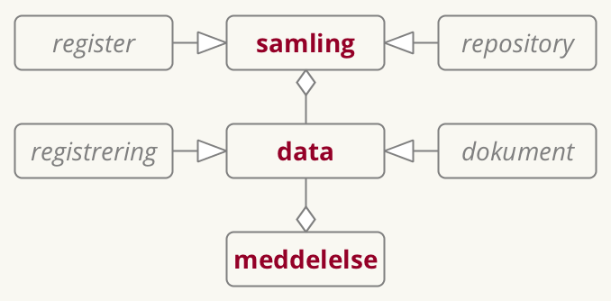
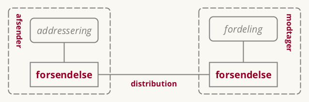
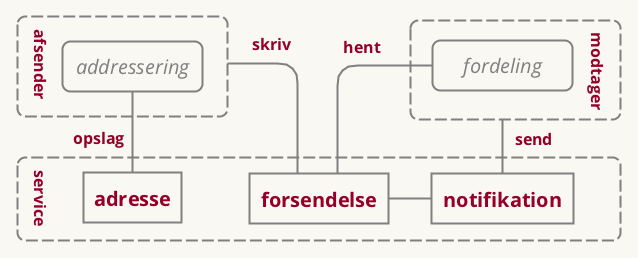

# Fællesoffentlig referencearkitektur for deling af data og dokumenter
*Versionsoversigt:*

_Version 0.1, september 2017. Arbejdsdokument, der bygger oven på en tidligere udarbejdet Synopsis for Referencearkitektur for deling af data og dokumenter (august 2017). Benyttet i workshop med arkitektarbejdsgruppen under SDA._

_Version 0.2, oktober 2017. Arbejdsdokument benyttet i forbindelse med anden workshop med arkitektarbejdsgruppen under SDA._

# Resume
Hverdagen er digital, og data om borgere, virksomheder, myndigheder, ejendomme, steder, køretøjer o.m.m. vedligeholdes i en lang række områder af den offentlige administration. Der ligger et stort potentiale i at gøre sådanne data tilgængelige for genbrug, så de kan skabe værdi i andre sammenhænge end formålet med det oprindelige register. Dette kan danne fundament for langt bedre understøttelse af tværgående, offentlige services, og åbner tillige for anvendelse af data i nye og innovative sammenhænge.

Men deling af data kan være teknisk kompliceret og i mange tilfælde omkostningstungt, bl.a. drevet af krav til sikkerhed og dermed bevarelse af borgeres og virksomheders tillid til datadeling i det offentlige Danmark. Derfor er potentialet i deling og genbrug af data i høj grad forblevet uindfriet.

Denne referencearkitekturs formål er at hjælpe med at indfri dette potentiale. Dette gøres ved at introducere en fælles beskrivelse af de begreber og sammenhænge, der er væsentlige for at forstå og arbejde med design og implementering af løsninger, der involverer deling af data og dokumenter. Dette sker både på det strategiske plan, hvor vision, mål og arkitektoniske principper fastlægges; på det forretningsmæssige plan, hvor de typiske brugsscenarier beskrives; og på det tekniske plan, hvor en række implementeringsmønstre angiver, hvordan man i og mellem applikationer kan dele og forsende data.

Referencearkitekturen er udarbejdet under den fællesoffentlige digitaliseringsstrategi 2016-2020 og er som sådan relevant for alle offentlige myndigheder og deres leverandører samt for virksomheder, der ønsker at gøre brug af offentlige data.

# Introduktion

## Formål og målgruppe

Referencearkitekturen for deling af data og dokumenter understøtter design, udvikling og anvendelse af offentlige it-systemer, der

- (gen)anvender oplysninger i form af data og dokumenter til sagsbehandling eller selvbetjening
- sender eller modtager meddelelser fra andre it-systemer

Dokumentet er primært målrettet it-arkitekter tilknyttet offentlige digitaliseringsprojekter, herunder enterprise-arkitekter, forretningsarkitekter og løsningsarkitekter, der har til opgave at kravspecificere og designe løsninger.

De første dele af dokumentet (Strategisk og Forretningsmæssig arkitektur) henvender sig endvidere til projektledere og beslutningstagere, herunder forretningsansvarlige, digitaliseringschefer, it-chefer, afdelings- og kontorchefer og andre med rollen som systemejer.

Dokumentet i sin helhed er også relevant for leverandører at orientere sig i.

## Scope

Referencearkitekturen beskriver anvendelse af og udvikling af it-systemer, der reguleres af blandt andet:

- EU databeskyttelse
 ~ *lov* som beskriver pligter og rettigheder ved behandling af persondata
- EU eIDAS
 ~ *lov* som definerer registrede tillidstjenester
- Persondata lov
 ~ *lov* som beskriver pligter og rettigheder ved behandling af persondata
- Lov om Digital Post
 ~ *lov* der gør det obligatorisk for virksomheder og borgere at modtage digitale meddelelser fra offentlige afsendere.

Referencearkitekturen skrives på baggrund af den fællesoffentlige digitaliseringsstrategi 2020 under initiativ 8.1 med tilslutning fra
FM, UFM, EVM, SIM, JM, EFKM, MBUL, SÆM, SKM, MFVM, BM, KL og Danske Regioner. Heri beskrives referencearkitekturen således:

> For at operationalisere, hvilke krav hvidbogen konkret stiller til initiativer og systemer udarbejdes en referencearkitektur for deling af data og dokumenter, der blandt andet beskriver fælles behovsmønstre og mønstre for teknisk understøttelse, herunder de forskelige roller, der skal afklares i initiativerne. Referencearkitekturen udpeger også eventuelle områder for eksisterende og nye fælles standarder og infrastruktur, som skal lette initiativernes implementering. Referencearkitekturen bliver således en generel ramme og støtte for alle initiativernes egen specifikke arkitektur.

Uden for scope:

- åbne data, der ikke kræver adgangskontrol
- registrering og anvendelse af data hos registerejer

## Centrale begreber
I det efterfølgende vil begrebet data blive brugt til at betegne både oplysninger på dokumentform og oplysninger der optræder i registre. Vi anvender begrebet datasamling både om et register og et repository med dokumenter.

Vi vil endvidere lave en skelnen mellem:
 - Anvendelse af udstillede data - typisk via API i system-til-system-integrationer
 - Forsendelse af meddelelser indeholdende data (herunder dokumenter) - typisk brugt ved beskeder til borgere/virksomheder, der skal have retsvirkning, men også et klassisk mønster brugt i system-til-system-integrationer.

Den fundamentale forskel på disse to scenarier er, om det er afsenderen eller modtageren af data, der kender formålet med interaktionen. Ved udstiling af data er dataafsenderen som udgangspunkt ikke bekendt med datamodtagerens formål (men er naturligvis forpligtet til at håndhæve relevant hjemmel). Ved forsendelse af meddelelser er det dataafsenderen, der i en given kontekst afsender en meddelelse med et givent formål - typisk som led i en proces.

## Anvendelse
Referencearkitekturen skal:

- danne et fælles sprog til at formulere en fælles handlingsplan
- bruges som reference ved løsningsbeskrivelser

## Tilblivelse og governance
Første udgave er skrevet hos Kontor for Data og Arkitektur af Mads Hjorth, Digitaliseringsstyrelsen og Anders Fausbøll, Omnium Improvement.

Endelig godkendelse forventes hos Styregruppe for Data og Arkitektur under Digitaliseringsstrategien 18. december 2017.

## Metoderamme
Referencearkitekturen er udarbejdet inden for rammerne af Fællesoffentlig Digital Arkitektur og følger så vidt muligt den fælles skabelon for referencearkitekturer som udarbejdet i DIGST/KDA. Metoderammen bygger blandt andet på erfaringer fra OIO referencearkitektur, og indarbejder også elementer fra EIRA, TOGAF, ArchiMate m.m.

Særlige elementer er i dokumentet angivet i *kursiv* (fx *lov*, *mål*, *rolle* m.m.). Dette markerer, at de hører til Archimate-begrebsapparatet.

## Relation til andre referencearkitekturer
Denne referencearkitektur gør brug af:

- Fællesoffentlig referencearkitektur for brugerstyring

Den skal kunne anvendes af:

- Fællesoffentlig referencearkitektur for selvbetjening
- Fællesoffentlig referencearkitektur for overblik over egne sager og ydelser

... og skal anvendes i kontekst sammen med:

- Deling af dokumenter på sundhedsområdet
- Indberetning til registre på sundhedsområdet
- Sag- og dokument på det kommunale område

# Strategisk arkitektur

Udarbejdelsen af referencearkitekturen tager udgangspunkt i en række identificerede forretningsmæssige og teknologiske trends og tendenser.

## Forretningsmæssige tendenser

[MBK: Hvad menes med ensretning?]: x
- Nationalt ønske om at undgå knopskudte løsninger
- Data har øget værdi for organisationer
- Øget bevågenhed omkring beskyttelse af privatliv
- Øget opmærksomhed om håndtering af personlige oplysninger
- Mængden af oplysninger der håndteres stiger
- Grænseoverskridende services

## Teknologiske tendenser
- øget central standardisering af begreber, datamodeller og grænseflader
- Flere og mere forskelligartede enheder forbundet til netværket
- Øgede forventninger til brugervenlighed af offentlige digitale services
- Mængden af tilgængelige oplysninger vokser
- Arkitekturvision for anvendelse og udstilling
- Integrated Service Delivery
- ”Interoperability/Samarbejdende infrastrukturer / Økosystem af fælles løsninger?”
- ”Valgfrihed for anvender mellem flere tekniske udbydere af samme oplysninger”

## Strategiske målsætninger
[TODO beskriv målsætninger i eksisterende aftaler og strategier, også gerne fra andre områder]: x
De overordnede målsætninger for denne referencearkitektur kobler alle til visionen om det datadrevne samfund, hvor data ses som et råstof for samfundsudviklingen.

Målsætningerne inkluderer:
- **Interoperabilitet**
  ~  *mål* om sammenhængende services... integrated service delivery
- **Once-only**
  ~  *mål* om at borger og virksomhed kun skal afgive den samme information til det offentlige en gang... (men give lov til genbrug?)
- **Transparens**
  ~ *mål* om at borgere og virksomheder skal kunne se, hvilke data der findes om dem, og hvor disse data anvendes
- **Genbrug**
  ~ *mål* om genbrug af it med henblik på lavere omkostninger

## Vision
Visionen i denne referencearkitektur er at stræbe efter en situation, hvor:

> *Data betragtes som en fælles, værdifuld og velbeskyttet ressource; de skal være nemme at dele og bruge, men svære at misbruge*

> *Data beskrives, fordeles, forbedres og beskyttes i fælleskab.*

> *Fælles metoder for datadeling understøtter sammenstilling af data og tværgående brug blandt myndigheder og virksomheder*

> *Beskrivelse af, adgang til og brug af data sker under klar governance og håndhæves ud fra tydelig hjemmel*

> *Borgere og virksomheder har overblik over deres data og hvor, de anvendes*

## Værdiskabelse
Værdien ved at følge denne referencearkitektur er, at den giver:
- Mindre besvær for borger og virksomheder ved brug af digitale services
- Simplere arbejdsgange og mere potentiale for automatisering hos organisationer (myndigheder/virksomheder)
- Understøttelse af værdiskabende innovation (ved at gøre data til et 'råstof' for vækst/skabelse af konkurrencefordele)
- Understøttelse transparens og bevare tillid til registre
- Effektiv systemudvikling (begrænser udfaldsrum, opsamler best practice)

## Strategiske principper

Forretningsmæssige, Informationsmæssige, Applikationsmæssige og Tekniske principper bag referencearkitekturen:

- F1: Byrden i datadeling skal afløftes fra dataejer, hvis den begrænser genbrug
- F2: Autoritative registre med henvisninger til andre registre
- F3: Ansvar for begrænsning af adgang ligger hos registerejer
- I1: Fælles referenceinformationsmodel
- I2: Dokument-princip (attester mv.)?
- A1: Onlineopslag i sagsbehandling og selvbetjening
- A2: Log adgang
- A3: Adgang til og fra internationale registre sker gennem national gateway
- T1: Central fuldmagts-/rettighedsstyring
- T2: Multi-flavour-api

<MBK: savner noget om fælles referencedata (masterdata, grunddata, klassifikationer)>
<MBK: savner noget om muligheder for at berige data (koble flere data omkring fælles objekter)>
<MBK: savner noget om kvalitetssikring af data - som lægger op til fx at kunne flage data med dårlig kvalitet, indmelde / foreslå ændring af fejl i data, især i delte masterdata og grunddata>

# Forretningsmæssig arkitektur

## Aktører
De væsentligste aktører, der er i spil omkring deling af data og dokumenter, er:
- Offentlige myndigheder, herunder virksomheder, der handler på vegne af offentlige myndigheder
- Borgere og virksomheder

## Opgaver
Forretningsmæssigt set finder referencearkitekturen anvendelse i løsningen af alle offentlige opgaver. Specifikt kan nævnes:
 - Borger- og virksomhedsvendte selvbetjeningsløsninger
 - Myndigheders sagsbehandling
 - Tværgående analyse, tilsyn og kontrol

## Funktioner
Referencearkitekturen kredser om tre centrale use cases, hvor aktører arbejder sammen i forskellige roller.

De tre use cases er:

**Registrering**
    ~ *collaboration* hvor oplysninger bringes på digital form

**Anvendelse af udstillede data** (herunder dokumenter)
  ~ *collaboration* hvor oplysninger anvendes i en opgave

**Forsendelse af meddelelser**
  ~ *collaboration* hvor meddelelser sendes uafviseligt

### Roller

I ovenstående use cases indgår disse roller:
- Registrant
  ~ *rolle* som bringer oplysninger på digital form, registrer

- Datasubject
  ~ *rolle* som oplysninger handler

- Dataanvender
  ~ *rolle* der anvender oplysninger fra et register

- Dataejer
  ~ *rolle* som ejer registreringer/data, ansvar for at udarbejde adgangspolitik

- Datadistributør
  ~ *rolle* som distribuerer data, ansvar for at håndhæve adgangspolitik

- Messaging User
  ~ *rolle* som der sender og modtager meddelelser

- Messaging Provider
  ~ *rolle* som leverer services til forsendelse

Nogle af overnstående roller kan betragtes som specialiseringer af GDPR-rollen *Databehandler*.

### Use cases

Figuren ovenfor beskriver det overordnede procesflow i de tre use cases. Væsentligt at fremhæve er:

**Registrering**: En registrant initierer processen ved at registrere ny data hos Dataejer (der er ansvarlig for sikring af hjemmel og håndhævelse af adgangspolitik). Når data er korrekt registreret, skal det markeres som klar til at blive udstillet.

**Anvendelse af udstillede data**: Denne proces initieres hos Dataanvender - typisk en myndighed, men kan også være en virksomhed - ud fra startsituationen, at man har erkendt et behov for data. Dataanvender sender en forespørgsel på data, der beskriver dels, hvilke data, der ønskes, og dels med hvilken hjemmel. Dataejer håndhæver på denne baggrund adgangskontrol, inden data deles og sendes i et svar til Dataanvender. Slutsituationen bliver, at Dataanvenders databehov er opfyldt. Dataejer er ikke nødvendigvis klar over, hvilket databehov forespørgslen har tjent til at tilfredsstille - så længe, adgangen er legitim, kender Dataejer ikke formålet med Dataanvenders brug af data.

**Forsendelse af meddelelser**: Til forskel fra Anvendelse af udstillede data starter denne proces hos Afsenderen (der tillige kan være Dataejer). Afsender har udvalgt og pakketeret data i en Meddelelse (evt. i form af et dokument), adresserer Meddelelsen og sender den herefter til Modtager. Modtager kan være alle typer af aktører; i figuren er vist, hvordan det hos en myndighed kan være relevant at fordele/route Meddelelsen internt ud fra adresseringsoplysningerne. I sammenligning med Anvendelse af udstillede data er det nu Afsender, der som deler af data 'ejer' den fulde forretningskontekst - hvor Dataejer overnfor ikke var bekendt med formålet med at dele data.

## Tværgående processer
Herunder beskrives, hvor de enkelte business functions hos de enkelte roller anvendes i kontekst af et sæt af generiske procesmønstre.

 - Sagsbehandling (fra Sag og dokument)
 - Simpel selvbetjening (fra Selvbetjening)
 - Tværgående selvbetjening (fra Sammenhængende services)
[MBK: <fra Selvbetjening, hvis i snakker om referencearkitektur. Vi har ikke en der hedder sammenhængende services>]: x
 - Indsigt i oplysninger og deres anvendelse (fra Overblik over sag og ydelser)
 - Sende meddelelse (inkl. brug af tilmeldingslister og påmindelser)
 - Modtage meddelelse
 - Tag et dokument med til en anden service provider, der ikke har adgang til registre - herunder beskrive, hvordan dokumenter valideres.

## Forretningstjenester
Procestrin udtrykkes typisk ved Forretningstjenester, der igen kan realiseres af interne business functions eller trække på eksterne business services.

[TODO]: x "[Vi skal være bedre til at beskrive hvordan vi trækker på elementer fra brugerstyring, men husk at holde det teknologi-fri]"

## Forretningsobjekter
Nedenfor fremgår en initiel oversigt over en række forretningsobjekter, der er væsentlige for referencearkitekturen. Det videre arbejde skal klarlægge, hvilke elementer der skal indgå i listen samt hvordan de defineres. Modelleringsniveauet skal endvidere lægges fast (begrebsmodellering og/eller logiske kernemodeller?) Kommentarer/regibemærkninger indgår i listen, markeret med kantede parenteser.

Data
  ~ *objekt* (Abstrakt. Bruges om både registerrecord og dokument)

Registeroplysning
  ~ *objekt* en record

Dokument
  ~ *objekt* [Dokumentmodel fra OIO]

Datasamling
  ~ *objekt* [Datasætmodel har ikke noget!] ISO9115: en identificerbar samling af oplysninger (samlebetegnelse for PSI, GPDR, )

Datasubjekt
  ~ *objekt* [Grunddata, fx person]

Model/Schema
  ~ *objekt* [Jf. modelregler fra FDA]

Meddelelse
  ~ *objekt* [Næste generation Digital Post]

Påmindelse
  ~ *objekt* [Næste generation Digital Post]

Registreringshændelse
  ~ *objekt* [Datafordeler]

<MBK: Liste og model matcher ikke helt>
<MBK: savner Dataservice, Forretningshændelse, Klassifikation>
<MBK: Der bør være noget om sammenhængen mellem Referenceinformationsmodel, Applikationsprofiler og Snitfaldespecifikationer (inkl operationer og format)
<MBK: Noget om anonymiserede data. Evt. kandidat til standardiseret metode>

## Forretningsmønstre

TBU. <cf issue #6>

# Teknisk arkitektur
Dette afsnit beskriver roller og implementeringsmønstre, der er relevante, når forretningsfunktionerne beskrevet ovenfor skal understøttes/realiseres af applikationer. Endvidere udpeges områder, der er kandidat til standardisering og/eller profilering i forbindelse med referencearkitekturen.

De nødvendige og understøttende applikations-services og deres indbyrdes relationer er vist i figuren nedenfor. <TODO: Opdater figurtekst.>

## Applikationsroller

eDelivery Service Provider
  ~ *applikationsservice* som skal kunne:

- udstille eller levere meddelelser til modtager
- modtage og distribuere meddeleleser
- fortælle andre om deres kunder

Dataservice
  ~ *applikationsservice* som skal kunne:

- opbevare datasamling
- begrænse adgang til de rigtige
- (måske) vedligeholde og udsende abonnementer
MBK: <vel også udstille / dele, understøtte fremsøgning, udtræk og evt yderligere operationer, som fejl rette, flage fejl o.l.>

Kontaktregister
  ~ *applikationsservice* som er en slags data service med en særlig type oplysninger

Log
  ~ *applikationsservice* som er en slags data service med særlige oplysninger

Indeks
  ~ *applikationsservice* som er en slags data service med særlige oplysninger. Kan undværes, men på kraftig bekostning af effektivitet i bestemte situationer.

Katalog
  ~ *applikationsservice* som ikke er en dataservice, fordi der ikke er begrænset adgang. Kan undværes, men ikke effektivt.

<MBK: Forstår ikke denne defintion. For mig er hverken et katalog eller en dataservice defineret ved adgangsrettigheder. Et katalog skal fx også kunne begrænse adgang og en dataservice skal også kunne tilbyde adgang til læs . søg, hent / download uden login hvis der er tale om åbne data uden rettighedsbegrænsninger.>

<MBK: Savner byggeblokke som fx Klassifikationsservices (både udstille klassifikationer og mapninger), Serviceregister, Systemkatalog, datakatalog, Modelkatalog.>

<TODO Skal vi have en "beskyttet dataservice" og en offentlig?>
<MBK: Det mener jeg er et must, jf hele open data agendaen>

## Tekniske Implementeringer
Her grupperes de enkelte roller og applikationsroller jf. forskellige mønstre.

### Anvendelse af udstillede data

Når en dataanvender (virksomhed eller myndighed) vil have adgang til data hos en dataejende myndighed, kan det ske via ét af nedenstående tre mønstre:
<TODO: Overvej samtykker ift. Virksomhed>
<TODO: Overvej Hændelser>

#### Direkte adgang

I dette mønster, som er simpelt og måske det mest klassiske, er det Dataejer, der selv udstiller data til de mulige anvendere via en service-orienteret arkitektur. Dataejer er også ansvarlig for at betjene Datasubjektets forespørgsler om Dataejerens brug af personlige data.

Fordelen ved dette mønster er, at det er simpelt. Ulempen er, at Dataejer kommer til at bære hele udgiften ved at stille data bredt til rådighed.

[MBK: SOA bruges ikkekun til direkte adgang, men kan også være via proxy, som fx datafordeleren, der jo også tilbyder SOA-services af forskellig flavour. AF: Fanget i næste mønster?]: x

[MBK: Der bør være noget om flavours af SOA EDA, LD. og om SOAP vs REST. Plus vel også koblingen til AS2/AS4 når vi snakker protokoller.]: x

[MBK: Måske ikke det rette sted for denne kommentar, men vi bør også komme omkring Linked data og Block Chain i et afsnit om teknologitrends. AF: Oprettet i Issue #5]: x

[MBK: Der bør også være noget om synkron vs asynkron og om fil/batch mønster]: x

#### Datadistribution

I dette mønster er Dataejer fortsat ansvarlig for registrering af data. Anvendelsesdelen er imidlertid afløftet til en Datadistributør (evt. flere). Dette giver Datadistributøren mulighed for at fokusere netop på distributionen, dvs. at gøre data bredt tilgængeligt (dog naturligvis under håndhævelse af adgangskrav specificeret af Dataejer) til Dataanvendere.

Når nye data registreres, er Dataejer ansvarlig for at opdatere Datasamlingen hos Datadistributøren.

Logningsmæssigt er den enkelte Datadistributør ansvarlig for at logge Dataanvenders adgang til data. Samtidig er den enkelte Distributør ansvarlig for at sørge for konsolidering af loggen. I figuren er log-konsolidering lagt hos Dataejer, men den kunne i princippet også være uddelegeret - så længe, der er et entydigt og klart SPOC for Datasubjektets opslag i anvendelsen af personlige data.

#### Distribueret service- og data-platform

Delingsansvaret er i dette mønster i høj grad håndteret af en Dataplatform. Platformen er distribueret og er i stand til at replikere data på tværs af Dataejer og Dataanvendere. Dvs., at data, der registreres via Dataejer, gøres tilgængelige hos Dataanvender af platformen.

Da Dataplatformen kan rumme data fra forskellige Dataejere, muliggøres effektiv sammenstiling af data hos Datanvenderen. Platformen er ansvarlig for at håndhæve adgangskontrol, og eventuelle services hos Dataanvender, der gør brug af data, er ansvarlige for at logge deres brug. Platformen konsoliderer brugs-loggen, og gør det muligt for Datasubjekt at få overblik over brug af personlige data.

Fordelen ved dette mønster er den umiddelbare og standardiserede tilgænglighed til data, som en Dataplatform kan levere. Ulempen er, at kompleksiteten øges, samt at der stilles større krav til Datanvenders modenhed ift. den tekniske adgang til data (da Dataanvenders applikationer i praksis vil skulle afvikles på den distribuerede Service- og Dataplatform).

*(Uafklaret: Skal Dataanvenders applikationer/services have direkte adgang til distribuerede data, eller skal adgang fortsat ske via et servicesnit, der kan varetage adgangskontol m.m.?)*

### Forsendelse af meddelelse

Når en myndighed vil initiere en specifik og målrettet datadeling - dvs. sende data (herunder dokumenter) til en anden myndighed, virksomhed eller borger - kan det ske via ét af de tre nedenstående mønstre.

#### Sikker e-mail

Et meget anvendt mønster for myndighed til myndighed-kommunikation er at levere en Meddelelse fra Afsender til Modtager ved brug af sikker e-mail. Det falder uden for dette dokuments scope at beskrive dette mønster yderligere, men det er medtaget her for reference. Det er endvidere oplagt at betragte dette mønster som et særtilfælde af det generelle 'Service provider'-mønster nedenfor.

Fordelen ved dette mønster er, at det er simpelt og benytter sig af standardteknologi. Ulempen er, at det kun dækker myndighed til myndighed-kommunikation. Derudover sætter standardteknologien (e-mail) visse begrænsninger for funktionalitet, der fx understøtter automatisk routing af beskeder hos modtageren i det tilfælde, hvor Meddelelsen ikke har én specifik modtager.

<MBK: Dette mener jeg vi bør forsøge at lægge uden for scope ifht at deling er vores hoedfokus. AF: DONE>

#### Fælles system

Ved brug af Fælles system-mønsteret til Forsendelse af en Meddelelse benytter Afsender og Modtager et centralt, fælles system til hhv. at placere Meddelelsen og læse den. I den analoge verden svarer dette mønster til, at Afsender og Modtager benytter et fælles postbokskontor. Digitalt er dette mønster fx implementeret af e-Boks, hvor såvel myndigheder, virksomheder og borgere kan placere Meddelelser, der efterfølgende kan hentes af Modtager. Også messaging-funktionaliteten i mange af de sociale medieplatforme (fx Facebook) falder i denne kategori.

TIl forskel fra Sikker e-mail-mønsteret ovenfor er Fælles system-mønsteret mere robust, både da Forsendelsesservicen tilbyder opslag/verifikation mod et Kontaktregister samt da Meddelelsen opbevares i infrastrukturen, indtil Modtager aktivt læser den - i modsætning til Sikker e-mail, hvori infrastrukturen blot videresender Meddelelsen og dermed er afhængig af, at Modtageren i praksis findes.

Meddelelsesfunktionaliteten har endvidere mulighed for at trække på en Notifikationsservice, der kan tilbyde notifikationer til Modtager om den nye Meddelelse.

Et Fælles system-mønster kan fungere på mange niveauer, herunder nationalt (fx Digital Post); inden for et specifikt domæne, fx på sundhedsområdet; eller rent bilateralt, hvor to organisationer vælger en Meddelelsesplatform og enes om dette mønster.

#### Økosystem/Service providers

[TODO Fjern opslags pile fra Modtager og Modtagers SP]: x

I dette mønster deltager både Afsender (A) og Modtager (D) i et Meddelelses-økosystem ved at vælge hver sin Forsendelses-Service provider (hhv. B og C). Økosystem-mønsteret er bl.a. kendt i kontekst af den europæiske eDelivery-standard som en *four corner model*.

Et fælles Kontaktregister udgør en central komponent i økosystemet, der gør det muligt for alle parter at slå den relevante information op. En Afsender kan via Kontaktregisteret se/verificere mulige modtagere, samt evt. afgøre hvilken konkrete Meddelelsesformater/kanaler, Modtager kan håndtere. Forsendelsesservicen, der håndterer afsendelse af Meddelelsen, kan benytte Kontaktregisteret til at finde Modtagerens konkrete Service provider og bliver dermed i stand til at levere Meddelelsen.

Mønsteret vil typisk være symmetrisk, således at en Afsender også kan indgå som Modtager og vice versa. Mønsteret kan i øvrigt både være generisk eller specifikt for et domæne, der fx kan stille ekstra krav til Meddelelsens format.

Fordelene ved Økosystem-mønsteret er, at det er robust, fleksibelt og løbende kan udvides med nye Service providers. Ulempen er, at der stilles store krav til det centrale Kontaktregister, samt at der fortsat ikke findes standardteknologier, der dækker mønsteret.

### Registrering

Registrering af data er ikke i scope for denne referencearkitektur, men medtages kort pga. sin væsentlige relation til Index-konceptet.
[TODO: Hvor udfolder vi mere om mønstre, der anvender Index?]: x

Ansvar hos registrant
  ~ *implementationsmønster*

Ansvar hos dataejer
  ~ *implementationsmønster*

Ansvar hos distributør
  ~ *implementationsmønster*

## Områder for standardisering/profileringer
Nedenstående, tekniske områder er kandidater til at indgå i referencearkitekturen i forhold til at pege på en anbefalet standard eller en særlig profilering, evt. vendt mod de enkelte, tekniske mønstre.

- Service Design Guidelines
- Access Protocols
- Distribution Protocols
- Synchronisation Protocols
- Metadata for opslag/søgning/anvendelse
- Log format
- Identifikation
- Klassifikation af følsomhed
- Klassifikation af anvendelse (sagsbehandling vs analyse)
- Hændelsesbeskeder
- Protokol for flytning af filer, kryptering
- Hjemmel (samtykke, lov)
- Context

[MBK: Web service beskrivelser er også et vigtigt emne. Fx en udvidelse af WSDL, så det understøtter Linked data. tal med Peter bruhn om dette.]: x
[MBK: Fælles liste over standard operationer og vejledning i hvordan de inarbedes ifbm med udarbejdelse af snitfladespecifikationer]: x
## Identifikation af eksisterende standarder
