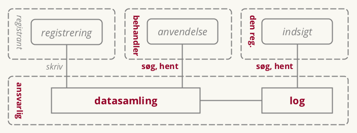
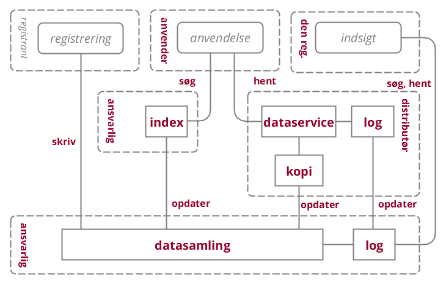

Version 0.1, september 2017. Arbejdsdokument, der bygger oven på en tidligere udarbejdet Synopsis for Referencearkitektur for deling af data og dokumenter, august 2017. Benyttet i workshop med arkitektarbejdsgruppen under SDA.

Version 0.2, primo oktober 2017. Arbejdsdokument benyttet i forbindelse med anden workshop med arkitektarbejdsgruppen under SDA.

Version 0.3, medio oktober 2017. Opdateret med input fra anden workshop. Udgør Delleverance 2 ift. projektet Referencearkitektur for deling af data og dokumenter.

Version 0.4, november 2017. Til intern brug i KDA.

**Version 0.5, december 2017. Til kommentering hos arbejdsgruppedeltagere og deres bagland**

*Version 0.7, forventet januar 2018. Til offentlig kommentering*

*Version 1.0, forventet marts 2018. Til vurdering hos Styregruppe for Data og Arkitektur*

# Resume
Hverdagen er digital, og data om borgere, virksomheder, myndigheder, ejendomme, steder, køretøjer m.m. vedligeholdes på en lang række områder af den offentlige administration. Der ligger et stort potentiale i at gøre sådanne data tilgængelige for genbrug, så de kan skabe værdi i flere sammenhænge. Deling af data er et fundament for langt bedre understøttelse af tværgående, offentlige services, og åbner for anvendelse af data i nye og innovative sammenhænge.

Men deling af data kan være teknisk kompliceret og i mange tilfælde omkostningstungt. Herudover er deling af data alid underlagt en række lovmæssige og organisatoriske krav, der synligt og til fulde skal opfyldes for at bevare borgeres og virksomheders tillid til datadeling i det offentlige Danmark. Begge udfordringer kan medføre øget kompleksitet i datadelingsløsningerne og er dermed blandt årsagerne til, at potentialet i deling og genbrug af data endnu ikke indfriet i det omfang, det er muligt.

Denne referencearkitekturs formål er at hjælpe med at indfri dette potentiale. Dette gøres ved at introducere en fælles beskrivelse af de begreber og sammenhænge, der er væsentlige for at forstå og arbejde med design og implementering af løsninger, der involverer deling af data og dokumenter. Dette sker både på det strategiske plan, hvor vision, mål og arkitektoniske principper fastlægges; på det forretningsmæssige plan, hvor de typiske brugsscenarier beskrives; og på det tekniske plan, hvor en række implementeringsmønstre angiver, hvordan man i og mellem applikationer kan dele og forsende data. Endelig peger referencearkitekturen på en række konkrete specifikationer, der anvendes ved deling af data og dokumenter i dag i den offentlige sektor.

Referencearkitekturen er udarbejdet under Den fællesoffentlige digitaliseringsstrategi 2016-2020 og skal som sådan anvendes i alle projekter, der sorterer under digitaliseringsstrategien. Referencearkitekturen er dermed relevant for såvel offentlige myndigheder, deres leverandører samt for virksomheder, der ønsker at gøre brug af offentlige data.

# Introduktion

## Formål, anvendelse og målgruppe

Det overordnede formål med denne referencearkitektur er at understøtte offentlig digitalisering i regi af Den fællesoffentlige digitaliseringsstrategi 2016-2020. Derudover kan referencearkitekturen finde anvendelse generelt i projekter i såvel offentlige som private digitaliseringsinitiativer.

Specifikt i sammenhæng med digitaliseringsstrategien skal referencearkitekturen anvendes:

1.  som reference i udarbejdelsen af løsningsbeskrivelser
2.  ved review af løsningsbeskrivelser
3.  til at danne et fælles sprog til at formulere en fælles handlingsplan blandt digitalieringsstrategiens parter

Samlet set skal referencearkitekturen bidrage til at skabe sammenhængende, sikre og effektive digitale services for borgere og virksomheder blandt andet gennem større genbrug af data samt ved at give mulighed for øget automatisering.

Dokumentet er primært målrettet it-arkitekter tilknyttet offentlige digitaliseringsprojekter, herunder enterprise-arkitekter, forretningsarkitekter og løsningsarkitekter, der har til opgave at kravspecificere og designe løsninger.

De første dele af dokumentet (Strategi og Forretningsmæssig arkitektur) henvender sig endvidere til projektledere og beslutningstagere, herunder forretningsansvarlige, digitaliseringschefer, it-chefer, afdelings- og kontorchefer og andre med rollen som systemejer.

Dokumentet i sin helhed er også relevant for nuværende og potentielle leverandører af offentlige it-løsninger.

## Scope

Referencearkitektur for deling af data og dokumenter understøtter design, udvikling og anvendelse af offentlige it-systemer, der videregiver eller modtager registrerede oplysninger i elektronisk form til/fra andre myndigheder, virksomheder og borgere.

Referencearkitekturen skrives på baggrund af Den fællesoffentlige digitaliseringsstrategi 2016-2020 under initiativ 8.1 med tilslutning fra
FM, UFM, EVM, SIM, JM, EFKM, MBUL, SÆM, SKM, MFVM, BM, KL og Danske Regioner. Heri beskrives referencearkitekturen således:

> For at operationalisere, hvilke krav hvidbogen konkret stiller til initiativer og systemer udarbejdes en referencearkitektur for deling af data og dokumenter, der blandt andet beskriver fælles behovsmønstre og mønstre for teknisk understøttelse, herunder de forskelige roller, der skal afklares i initiativerne. Referencearkitekturen udpeger også eventuelle områder for eksisterende og nye fælles standarder og infrastruktur, som skal lette initiativernes implementering. Referencearkitekturen bliver således en generel ramme og støtte for alle initiativernes egen specifikke arkitektur.

I et juridisk perspektiv er dette område reguleret af en lang række forordninger og love. De mest relevante specielt med hensyn til videregivelse af persondata er:

EU-persondataforordningen (GDPR)
  ~ *forordning* som beskriver pligter og rettigheder ved behandling af persondata. I sammenhæng med denne referencearkitektur er GDPR fundamentalt relevant, da en stor del af de data, der er registreret af offentlige myndigheder, netop er personhenførbare. Da persondata er en af de datatyper, der er strengest reguleret (sammenlignet med fx virksomhedsdata, geodata, registrering af objekter m.m.), har vi valgt at genbruge mange termer og begreber fra netop GDPR i denne referencearkitektur. Herudover er en række aspekter, der dækkes af GDPR, relevante - fx definitionen af gyldige grunde til datadeling, den nødvendige hjemmel i form af borgeren (den registreredes) samtykke, og meget mere. GDPR er således nødvendig læsning for enhver, der planlægger at genbruge persondata i offentlige sagsgange, selvbetjeningsløsninger m.v.

Persondataloven
  ~ *lov* som beskriver pligter og rettigheder ved behandling af persondata. Relevansen for denne referencearkitektur er i høj grad den samme som for GDPR. Det bemærkes, at Persondataloven forventes helt eller delvist erstattet af en kommende Databeskyttelseslov, der på tidspunktet for dette dokuments udarbejdelse behandles i folketinget, og som sammen med GDPR fremover vil definere den registreredes rettigheder.

Med hensyn til digitalisering generelt er følgende love særligt relevante:

EU-forordningen eIDAS (electronic IDentification, Authentication and trust Services)
  ~ *forordning* som definerer registrerede tillidstjenester. Forordningen specificerer bl.a., at elektroniske transaktioner, der opfylder kravene i eIDAS, altid har samme juridiske gyldighed som klassiske, papirbårne transaktioner. Forordningen fjerner dermed en klassisk barriere for digitalisering. I forhold til denne referencearkitektur bemærker vi, at eIDAS har et udpræget grænseoverskridende (*cross border*) fokus. Det grænseoverskridende aspekt af datadeling behandles ikke i dette dokument.

Lov om Digital Post
  ~ *lov* der gør det obligatorisk for virksomheder og borgere at modtage digitale meddelelser fra offentlige afsendere. Digital Post er således en helt fundamental kanal, når myndigheder ønsker at dele data og dokumenter med borgere og virksomheder gennem meddelelser.

Derudover er der en række mere specifikke love, der sætter rammer for datadeling i den offentlige forvaltning, fx inden for særlige sektorer eller domæner. Listen nedenfor inkluderer de væsentligste, men forsøger i øvrigt ikke på at være udtømmende.

Sundhedsloven
  ~ *lov* der regulerer hvem der har ansvar for behandling, forebyggelse og sundhedsfremme i det danske sundhedsvæsen. Sundhedsdata om borgere udgør en særlig følsom kategori af data, og Sundhedsloven regulerer derfor i detaljer, hvordan og til hvilke formål data kan behandles. Hvem, der har adgang til data, og hvordan adgang kan begrænses (herunder 'negativt samtykke', der i nogen grad svarer til GDPR-begrebet 'begrænsning af behandling'), er ligeledes reguleret med relativt finkornet granularitet.

Serviceloven
  ~ *lov* der udstikker rammerne for rådgivning og støtte for at forebygge sociale problemer samt for at tilbyde ydelser til borgere med nedsat fysisk eller psykisk funktionsevne eller særlige sociale problemer. Loven danner baggrund for sagsbehandlingsforløb, der typisk kan involvere en række forskellige myndigheder. Dermed er loven et godt eksempel på, hvordan der juridisk kan gives hjemmel til deling/videregivelse af data i en række, konkrete scenarier.

Forvaltningslov
  ~ *lov* der indeholder regler om borgernes retsstilling over for den offentlige forvaltning. I forbindelse med sagsbehandling i offentlige forvaltninger regulerer loven bl.a. aktindsigt fx i begrundelse for afgørelser. I forhold til denne referencearkitektur spiller Forvaltningsloven bl.a. ind i diskussionen om forholdet mellem data og dokumenter.

Scope for denne referencearkitektur er, som navnet angiver, selve delingen/videregivelsen af data (herunder persondata og evt. i form af dokumenter). Vi søger ikke at definere *anvendelsen* af data, herunder hvordan data registreres, eller hvordan den aktør (fx en myndighed), der afsender eller modtager data, benytter disse data i en konkret arbejdsgang. Processerne for registrering samt afsendelse og modtagelse af en meddelsese er dog summarisk beskrevet for at introducere begreber, der er relevante for at kunne tale om selve delingen/videregivelsen af data.

Specifikt er det uden for scope af denne referencearkitektur at definere:

- Anvendelse af data, herunder:
  - Registrering og intern anvendelse af data hos den dataansvarlige myndighed
  - Konteksten for en aktørs behov for at forespørge på data, videregive data via en meddelelse eller modtage data via en meddelelse
- Streaming af data (videodata, IoT-data m.m.)
- Grænseoverskridende (cross-border) datadeling

I forhold til streaming af data bemærkes det, at streaming løseligt kan beskrives som en seriel række af processen `videregivelse på forespørgsel`, som vi beskriver senere i dette dokument. Eventuelle, yderligere aspekter ved streaming, der kan være relevante at dykke ned i i referencearkitektursammenhæng, er ikke inkluderet i denne referencearkitektur, men må henvises til en specialiseret referencearkitektur for streaming af data.

I forhold til grænseoverskridende datadeling er mandatet for denne referencearkitektur begrænset til bestemte initiativer forankret hos de myndigheder, der er del af Den fællesoffentlige digitaliseringsstrategi 2016-2020. Mandatet inkluderer ikke myndigheder i andre lande, hvorfor en beskrivelse af grænseoverskridende datadeling aldrig vil kunne blive fyldestgørende.

## Centrale begreber
Data, oplysninger og informationer er tæt relaterede begreber og deres umiddelbare forståelse er meget forskellig på tværs af forskellige faggrupper og praksisser.

Vi vil i denne referencearkitektur holde os fra at komme med en længere fænomænologisk udredning og fokusere på en mere pragmatisk og lokal definition.

[TODO: Tilføj to eksempler: CPR-register + Røntgenbilleder]

[TODO: Afstem at begreber i figur er forklaret i ovenstående tekst, samt fold tekst ud (specialisering m.m.)]

[Dokumenter granularitet og samlet forvaltningsobjekt, databaser er mere finkornert udtræk, opslag...]

I det efterfølgende vil begrebet `data` blive brugt til at betegne både oplysninger på dokumentform og oplysninger, der optræder i registre. Vi anvender begrebet `samling` både om et `register` og et `repository` af dokumenter (termen `repository` anvendt jf. Referencearkitektur for deling af dokumenter og billeder, 2012).

Endvidere vil vi undlade at bruge ordet `metadata`. Ordet anvendes historisk set meget forskelligt, typisk med en betydning der er tæt knyttet til en konkret anvendelsessituation. Fra denne referencearkitekturs synspunkt er `metadata` imidlertid blot en særlig form af `data`.

Et af hovedformålene med denne referencearkitektur er at vejlede i valget mellem de to grundlæggende, generiske procesmønstre for videregivelse af data:

 - `Videregivelse på forespørgsel` - typisk via et API i system til system-integrationer
 - `Videregivelse ved meddelelse` indeholdende data (herunder dokumenter) - typisk brugt ved beskeder til borgere/virksomheder, der skal have retsvirkning, men også et klassisk mønster brugt i system til system-integrationer. [TODO: Knyt til EIDAS (Elektronisk leveringstjeneste - artikel 44)]

Den fundamentale forskel på disse to scenarier er, om det er den aktør, der videregiver data eller den aktør, der modtager data, der kender den konkrete kontekst for, hvordan data skal anvendes. Afsnittet [TODO: henvisning til Forretningsarkitektur]

Ved `videregivelse på forespørgsel` er dataafsenderen som udgangspunkt ikke bekendt med datamodtagerens formål (men er naturligvis forpligtet til at håndhæve relevant hjemmel). Et eksempel på dette er en myndigheds forespørgsel på personoplysninger i CPR-registeret.

Ved `videregivelse ved meddelelse` er det dataafsenderen, der i en given kontekst afsender en meddelelse med et givent formål - typisk som led i en proces. Et eksempel på dette er politiets fremsendelse af en fartbøde til en borger.

## Tilblivelse og governance
Første udgave er skrevet hos Kontor for Data og Arkitektur af Mads Hjorth, Digitaliseringsstyrelsen og Anders Fausbøll, Omnium Improvement.

(TODO: Deltagere i arbejdsgruppe)

Endelig godkendelse forventes hos Styregruppe for Data og Arkitektur under Digitaliseringsstrategien 5. marts 2018.

(Videre vedligeholdelse i regi af FDA, næste version fokus på sammenhæng med øvrige)

## Metoderamme
Referencearkitekturen er udarbejdet inden for rammerne af Fællesoffentlig Digital Arkitektur og følger så vidt muligt den fælles skabelon for referencearkitekturer som udarbejdet i Sekretariatet for Styregruppen for Data og Arkitektur under digitaliseringsstrategien. Metoderammen bygger blandt andet på erfaringer fra OIO referencearkitektur, og indarbejder også elementer fra EIRA, TOGAF, ArchiMate m.m.

I dokumentets tekst er særlige elementer angivet i *kursiv* (fx *lov*, *mål*, *rolle* m.m.). Dette markerer, at de hører til Archimate-begrebsapparatet. Andre elementer er angivet med særlig `markering`. Her er der tale om referencer til begreber/elementer fra figurer. Det bemærkes, at prefixet 'data-' kan være udeladt på begreber/elementer i tekst og figurer fx af formatterings- eller læsbarhedshensyn uden, at der ligger en indholdsmæssig skelnen bag (fx `dataanvendelse`/`anvendelse`, `datasamling`/`samling` o.a.)

I figurer og tekst markerer:

- _Kursiv_: At et element eller en relation ikke er nærmere defineret i denne referencearkitektur (fx _dokument_)
- `Blå tekst`: At et element eller en relation ejes og defineres i denne referencearkitektur (fx `anvendelse`)

I elementerne i dokumentets figurer angiver:
- Runde hjørner: At det er et Procestrin (Business Functions, jf. Archimate)
- Skarpe hjørner: At det er en Applikationsrolle (Application services, jf. Archimate)
- "Slikkepind" er interfaces/applikationsfunktioner/operationer

## Relation til andre referencearkitekturer
Denne referencearkitektur gør brug af:

- Fællesoffentlig referencearkitektur for brugerstyring

Den skal kunne anvendes af:

- Fællesoffentlig referencearkitektur for selvbetjening
- Fællesoffentlig referencearkitektur for overblik over egne sager og ydelser

... og skal anvendes i kontekst sammen med:

- OIO Sag- og dokumenter (2008)
- Deling af dokumenter og billeder på sundhedsområdet (2012)
- Referencearkitektur for informationssikkerhed på sundhedsområdet (2013)
- Indberetning til registre på sundhedsområdet (under godkendelse pr. november 2017)

(TODO: tilføjer hyperlinks...)

# Strategi
Referencearkitekturen udmønter og understøtter beslutninger i den Fællesoffentlige Digitaliseringsstrategi 2020. Desuden er der i udarbejdelsen taget hensyn til en række aktuelle, offentlige/politiske strategier, herunder Sammenhængsreformen, Cybersikkerhedsinitativet og kommunernes digitaliseringsstrategi "Lokal og Digital". Der kan på tværs af strategierne identificeres en række forretningsmæssige og teknologiske tendenser, som ligeledes har bidraget til at sætte retningen for den ønskelige arkitektur.

[TODO: Fold bullet-liste ud med flere kommentarer - i et narrativ]

- Sammenhængende offentlige services - gode brugerrejser [TODO: Knyt til sammenhængsreform)]
- Suverænitet, beskyttelse mod cyberangreb
- Øget opmærksomhed om behandling af personlige oplysninger
- Grænseoverskridende services

- Øget standardisering af begreber, datamodeller og grænseflader
- Flere og mere forskelligartede enheder forbundet til netværket
- Scale-out løsninger til web-scale

## Strategiske målsætninger
[TODO Beskriv målsætninger i eksisterende aftaler og strategier, også gerne fra andre områder]

De overordnede målsætninger for strategierne kobler alle til visionen om det datadrevne samfund, hvor data ses som et råstof for samfundsudviklingen.

Målsætningerne inkluderer:

> *Det digitale sksl være let, hurtigt og sikre god kvalitet* (Digitaliseringsstrategien)

Mere generisk kan man udpege fire overordnede mål:

Interoperabilitet
  ~  *mål* om sammenhængende services... integrated service delivery

Once-only
  ~  *mål* om at borger og virksomhed kun skal afgive den samme information til det offentlige en gang... (men give lov til genbrug?) [TODO: Tjek baggrund i strategi/Hvidbog - issue #39]

Transparens
  ~ *mål* om at borgere og virksomheder får øget indsigt i, hvilke oplysninger der er registreret om dem hos hvilke offentlige myndigheder, hvem der anvender disse og til hvilke formål

Genbrug
  ~ *mål* om genbrug af it med henblik på lavere omkostninger

## Vision
Visionen i denne referencearkitektur er at stræbe efter en situation, hvor:

> *Data er en fælles, værdifuld og velbeskyttet ressource, som skal være nem at dele og bruge, men svær at misbruge*

[TODO: Fold visionen ud ord for ord. Skal være 'meningsfuldt' - 'what's in it for me?' for den registrerede.]

[TODO: Hvilke forretningsevner der kommer i fokus, og hvad vi skal være bedre til... Data er fælles kræver mere ensartede rammer og lovgivning, værdifulde kræver at de er velbeskret, velbeskyttet kræver indsats der står i mål med trusler...]

## Værdiskabelse
Værdien ved at følge denne referencearkitektur er, at den understøtter:

- enklere og mere effektive digitale services for borgere og virksomheder
- simplere arbejdsgange og mere potentiale for automatisering hos organisationer (myndigheder/virksomheder)
- vækst gennem nye typer af services baseret på eksisterende data
- øget transparens og bevarelse af tillid til registre
- effektiv systemudvikling (begrænser udfaldsrum, opsamler best practice)
[TODO: Tilføj juridisk værdiskabelse (GDPR, EU (EIDAS m.m.)) - issue #32]
[TODO: Stram op og fold ud, kig eventuelt på hvad der følger alene af denne... Bind dem op på de strategiske målsætninger]

## Strategiske principper

Den Fællesoffentlige Digitale Arkitektur udpeger en række principper til rammesætning og styring af den offentlige digitalisering. I denne referencearkitektur er fokus at understøtte arkitekturprincippet om, at *Gode data deles og genbruges* og i særlig grad reglen: *6.1 Del og genbrug data*. Referencearkitekturen tilbyder to måder, hvorpå data kan videregives til genbrug og seks forskellige tekniske integrationsmønster som det kan realiseres gennem.

Derudover har en række af arkitekturreglerne konsekvenser for dette arbejde:

*AR 1.2 Optimer arkitektur efter projektets og de fælles mål*
- Udgifter i datadeling skal fordeles - byrden i datadeling skal afløftes fra dataejer, hvis den begrænser genbrug

*AR2.5 Stil data og løsninger til rådighed for private*
- Fælles metoder for datadeling understøtter sammenstilling af data og tværgående brug blandt myndigheder og virksomheder

*AR3.1 Tag højde for juridiske bindinger i forhold til deling og genbrug af data og it-systemer*
- Dataudveksling mellem organisationer designes ud fra en "dokument-tankegang" (aht. journalisering, forvaltningsret, tvistafgørelse, indsigter m.m.
- Modeller funderes (med eksplicitte referencer) i relevant lovgivning nationalt og internationalt

*AR4.1 Opfyld krav til informationssikkerhed og privatlivsbeskyttelse*
- Understøtte borgeres og virksomheders indsigt i opbevaring og anvendelse af følsom data.
- Beskrivelse af, adgang til og brug af data sker under klar governance og håndhæves ud fra tydelig hjemmel
- Begræns opbevaring af kopiregistre mest muligt

*AR4.2 Anvend fælles arkitektur for informationssikkerhed* (Brugerstyring?)
- Ansvar for begrænsning af adgang ligger hos dataansvarlig (aka registerejer)
- Vedlighold af fuldmagt og samtykker sker løst koblet fra deres håndhævelse

*AR5.1 Optimér tværgående processer efter fælles mål*
- Data beskrives, fordeles, forbedres og beskyttes i fællesskab

*AR6.2 Anvende fælles regler for dokumentation af data*
- Anvend fælles referenceinformationsmodel, grund- og referencedata

GDPR har også nogle principper:

*lovlighed, rimelighed og gennemsigtighed*

*formålsbegrænsning* (undtagelse for arkiv, forskning og statistik)

*dataminimering*

*rigtighed* (straks slettes eller berigtiges)

*opbevaringsbegrænisning*

*integritet og fortrolighed*

*ansvarlighed* (skal kunne påvise at ovenstående overholdes)

og lovlige behandlinger hos offentlige myndigheder er:

*Den registreredes samtykke*

*Opfyldelse af kontrakt*

*retlig forpligtigelse hos dataansvarlig*

*beskyttelse af vitale interesser*

*opgaver i samfundets interesse eller myndighedsudøvelse*

[TODO: Tilføj opsummering af Strategiafsnit]

# Forretningsarkitektur

## Aktører
De væsentligste aktører, der er i spil omkring deling af data og dokumenter, er:

- Offentlige myndigheder (herunder virksomheder, der handler på vegne af offentlige myndigheder?)
- Borgere
- Virksomheder

## Forretningstjenester og funktioner
Overordnet set finder referencearkitekturen anvendelse i løsningen af alle offentlige opgaver. Specifikt kan nævnes nedenstående sæt af generiske procesmønstre:

- Myndigheders sagsbehandling (fra Referencearkitektur for Sag og dokument)
- Selvbetjening, vendt mod borgere og virksomheder (fra Referencearkitektur for Selvbetjening)
- Indsigt i oplysninger og deres anvendelse (fra Referencearkitektur for Overblik over sag og ydelser)
- Sende meddelelse (inkl. brug af tilmeldingslister og påmindelser)
- Modtage meddelelse
- Tag et dokument med til en anden service provider, der ikke har adgang til registre - herunder beskrive, hvordan dokumenter valideres.
- Tværgående analyse, tilsyn og kontrol

Referencearkitekturen kredser om fire centrale, delte _use cases_, hvor aktører arbejder sammen i forskellige roller.

De fire use cases er:

registrering af data
  ~ *collaboration* hvor oplysninger bringes på digital form

indsigt i anvendelse af data
  ~ *collaboration* hvor en borger får indsigt i anvendelse af personlige data

anvendelse af data
  ~ *collaboration* hvor oplysninger opbevaret hos en aktør anvendes hos en anden

forsendelse af meddelelser
  ~ *collaboration* hvor meddelelser sendes mellem to aktører

## Forretningsroller

I ovenstående use cases indgår disse forretningsroller:

registrant
  ~ *rolle* som bringer oplysninger på digital form, registrer

den registrerede
  ~ *rolle* den person (datasubjekt), som oplysningerne vedrører

anvender
  ~ *rolle* der anvender data/oplysninger fra et register (aka databehandler)

dataansvarlig
  ~ en fysisk eller juridisk person, en offentlig myndighed, en institution eller et andet organ, der alene eller sammen med andre afgør, til hvilke formål og med hvilke hjælpemidler der må foretages behandling af personoplysninger (*rolle*)

databehandler
  ~ en fysisk eller juridisk person, en offentlig myndighed, en institution eller et andet organ, der behandler personoplysninger på den dataansvarliges vegne (*rolle* fra GDPR)

afsender
  ~ *rolle* som genererer og afsender meddelelser til en specifik modtager

modtager (af personoplysninger)
  ~ en fysisk eller juridisk person, en offentlig myndighed, en institution eller et andet organ, hvortil personoplysninger videregives, uanset om det er en tredjemand eller ej

modtager (af forsendelse)
  ~ ...

[TODO: Overvej om vi kan reducere til rene forretningsroller: registrant, den registrerede, dataansvarlig, databehandler; og til use cases: registrering, vidergivelse, sletning og arkivering. Konsekvensret i processer.]

## Tværgående processer
I ovenstående diagram over centrale use cases er `videregivelse` den væsentligste, da den rummer selve delingen af data. Dykker man ned i den, findes den i to grundvarianter, hhv. `videregivelse på forespørgsel` og `videregivelse ved meddelelse`. Figuren nedenfor beskriver disse to varianter på procesform og knytter dem tillige sammen med en kort beskrivelse af processen `registrering af data`.

Nedenfor er de to grundvarianter for datadeling `videregivelse på forespørgsel` og `videregivelse ved meddelelse` beskrevet i detaljer. `Registrering af data` er ligeledes beskrevet, dog mere summarisk, da den i kontekst af denne referencearkitektur kun er med af referencehensyn.

[TODO: Tilføj Søgning til Anvendelse af data.]

### Registrering af data

Denne proces dækker de overordnede trin i at registrere data. Procestrinene er ikke foldet så meget ud som for de øvrige use cases, da registrering af data ikke falder i scope for denne referencearkitektur. Dog er en kort beskrivelse medtaget for reference på grund af den tætte sammenhæng mellem registrering og udstilling af data. Procestrinene er:

registrer data
  ~ *procestrin* hvor oplysninger bringes på digital form

En `registrant` er i besiddelse af data, der skal registreres hos en `dataansvarlig`. I denne sammenhæng skelnes ikke mellem, om registreringen angår ny data eller ændringer til data (i sidstnævnte tilfælde kan det være `den registrerede`, der agerer som `registrant`.)

modtag data
  ~ *procestrin* hvor data placeres i en samling

Den `dataansvarlige` `myndighed` modtager data fra `registranten`. I denne forbindelse skelnes ikke mellem, om data modtages automatisk eller manuelt. I begge tilfælde er den `dataansvarlige` dog ansvarlig for at håndhæve adgangspolitik og herunder sikre, at `registranten` har gyldig hjemmel til at fremsende `registreringen`.

valider data
  ~ *procestrin* hvor modtagne data valideres før anvendelse

Den `dataansvarlige` myndighed validerer det modtagne data. Den `dataansvarlige` kan have varierende krav til datas kvalitet og komplethed, afhængig af formålet med `datasamlingen`. Fejlscenarier, hvor data ikke kan valideres, dækkes ikke af  denne referencearkitektur.

udstil data
  ~ *procestrin* hvor data gøres tilgængelige for andre

Når data er korrekt registreret, skal de markeres som klar til at blive udstillet. Her kan der være forskel på, om data gøres tilgængelig øjeblikkeligt eller først på et senere tidspunkt (fx ved registrering af fremtidigt skift af adresse). Begge muligheder kan være relevante, og vil i mange tilfælde afhænge af `dataanvenderes` typiske behov.

Når man skal vurdere processen `registrering af data`, er følgende kvaliteter og kriterier de mest væsentlige at forholde sig til:

* **Identifikation**: Sikker identifikation af `registrant` (så `dataansvarlig` kan håndhæve adgangskontrol) og `dataansvarlig` (så `registrant` kan have tillid til, at de potentiel følsomme data ender hos rette modtager).
* **Sikkerhed**: Tillid til, at data når ukompromitteret frem, herunder tjek af `registreringens` integritet, mulighed for kryptering af følsomme data, transaktionssikkerhed m.m.
* **Kontekst**: I hvilken kontekst er data skabt/opsamlet - hvor og af hvem?
* **Kvalitet**: Hvilke krav er der til data komplethed, hvor meget valideres i forhold til stærke datatyper, og er `registreringens` granularitet passende (hvor meget registreres ad gangen)?

[TODO: Skal alle kriterier/kvaliteter her og nedenfor formuleres som spørgsmål?]

### Videregivelse på forespørgsel

Denne proces dækker, at en `dataanvender` - typisk en myndighed, men kan også være en virksomhed - søger adgang til data, der på forhånd er gjort tilgængelige af en `dataansvarlig`. De indgående procestrin er:

behov opstår
  ~ *forhåndsbetingelse/begivenhed?* [todo: definition]

Processen starter hos `anvender`, der har identificeret et behov for at indhente data. Dette behov opstår typisk i kontekst af andre processer, som vi ikke specificerer nærmere her, men som indbefatter sagsbehandling, selvbetjeningsløsninger, analyser og meget mere.

forespørg om data
  ~ *procestrin* hvor en anvender spørger om udstillede data

`Dataanvender` sender en forespørgsel på data, der beskriver, hvilke data der ønskes. Ved adgang til andet end åbne data skal den nødvendige hjemmel ligeledes fremgå af forespørgslen, så `dataansvarlig` kan håndhæve den nødvendige adgangskontrol.

vurder adgang
  ~ *procestrin* [todo: definition]

`Dataansvarlig` myndighed vurderer i dette trin forespørgslen med henblik på at håndhæve adgangskontrol. Kun, hvis den medsendte hjemmel giver lovmæssig adgang til den forespurgte data, kan `dataansvarlig` gå videre med delingen. Hjemlen kan være eksplicit angivet eller ligge implicit i brugerstyringen. Hjemlen kan enten give generel adgang til en given `datasamling`, eller give adgang til specifik data i `samlingen`, hvorfor der i mange situationer vil være behov for at se på hjemlen og det efterspurgte data i sammnenhæng for at håndhæve adgangskontrollen. Et særligt aspekt i at vurdere adgang er håndhævelsen af 'negativt samtykke', hvor adgang til bestemte data er fjernet, fx fordi datas korrekthed er bragt i tvivl og skal undersøges. Dette procestrin kan i øvrigt benyttes af `dataansvarlig` til at håndhæve adgangskontrol også på andre planer som håndhævelse af en Service Level Agreement, beskyttelse mod misbrug, mistænkelig adfærd m.m. Det bemærkes endvidere, at `dataansvarlig` kan have overladt distributionsopgave og de praktiske opgaver for håndhævelse af adgangskontrollen til en `datadistributør`, hvilket i øvrigt ikke ændrer ved beskrivelsen af dette trin.

del data
  ~ *procestrin* hvor data videregives til andre

`Dataansvarlig` håndterer forespørgslen ved at slå data op i `datasamlingen`, evt. ved at sammenstille data fra flere `datasamlinger`, og sender et `svar` tilbage til `anvender`. Delingen af data bliver logget af `dataansvarlig`, indbefattende hvilken data, der blev delt; til hvilken `anvender`; og med hvilken hjemmel. Det bemærkes, at `dataansvarlig` ikke nødvendigvis er klar over, hvilket databehov forespørgslen har tjent til at tilfredsstille - så længe, adgangen er legitim og foretaget på baggrund af gyldig hjemmel, har `dataansvarlig` ikke behov for at kende til `dataanvenders` brug af data i den konkrete forespørgsel.

modtag svar
  ~ *procestrin* [todo: definition]

`Dataanvender` modtager svaret fra `dataansvarlig.`

oversæt svar
  ~ *procestrin* [todo: definition]

I tilfælde af, at der er behov for at oversætte `svaret` i form af mapninger af datafelter, klassifikationer m.m., håndteres dette på `dataanvenders` side. `Dataanvenders` initielle behov for data er hermed opfyldt.

Når man skal vurdere processen `Anvendelse af data`, er følgende kvaliteter og kriterier de mest væsentlige at forholde sig til:

  * **Identifikation**: Det skal være muligt for både `dataansvarlig` og `dataanvender` at identificere hinanden entydigt og sikkert.
  * **Adgangskontrol**: Der skal være en effektiv adgangskontrol, der opfylder kravet til at kunne dokumentere en tydelig og nødvendig hjemmel med skyldig hensyntagen til effektivitet i løsningen
  * **Søgning**: `Dataansvarlig` bør tilbyde en søgefunktionalitet, der tillader `anvender` at fremsøge data effektivt på tværs af distribuerede, ensartede `datasamlinger` (fx røntgenbilledregistre), eller ud fra et sæt af kriterier.
  * **Sammenstilling**: `Dataansvarlig` kan, hvor det måtte være hensigtsmæssigt ift. specifikke behov, vælge at sammenstille data fra flere `datasamlinger` og udstille en service, der tilbyder det sammenstillede data.
  * **Indsigt**: Processen skal understøtte effektiv indsigt i anvendelse (logning)
  * **Opbevaring**: `Dataanvender` bør benytte den autoritative `datasamling` direkte hvis muligt. Herved undgås, at der opbygges 'skyggekopier' af `datasamlinger`, der introducerer kompleksistet i forbindelse med synkroisering, aktualitetsudfordringer m.m.

Det bemærkes, at processen for den delte use case `Indsigt i anvendelse`, hvor `den registrerede` benytter sig af sin ret til indsigt i, hvordan data om ham/hende er blevet anvendt, er et særtilfælde af `Anvendelse af data`. Den er derfor ikke beskrevet selvstændigt.

### Videregivelse ved meddelelse

Denne proces dækker, at en `afsender` - typisk en myndighed eller en virksomhed - har behov for at sende data (evt. i form af et dokument) til en `modtager`. De indgående procestrin er:

behov opstår
  ~ *forhåndsbetingelse* [todo: definition]

Processen starter hos `afsender`, der - typisk i kontekst af en anden, overliggende proces - har behov for at dele data ved at sende en `meddelelse` til en `modtager`.

dan indhold af meddelelse
  ~ *procestrin* [todo: definition]

Første trin er, at `afsender` danner indholdet af meddelelsen. Indholdet kan være data under kontrol af `afsender` selv, men kan også indhentes fra andre via processen `Anvendelse af data` (der dermed bliver en underproces til `forsendelse af meddelelse`, der i sig selv typisk også er en underproces).

adressér meddelelse
  ~ *procestrin* [todo: definition]

Dette trin giver mulighed for at angive en slutmodtager for `meddelelsen`, der kan være mere specifik end blot `modtager`. Som eksempel kan `modtager` i nogle tilfælde være en organisation, og der kan være behov for at specificere en bestemt ansat som slutmodtager, hvilket kan tilføjes som metadata til `meddelelsen`.

afsend meddelelse
  ~ *procestrin* [todo: definition]

Afsendelse af `meddelelsen` sker i dette trin. `Afsender` er ansvalig for at logge hvilke data, der er sendt, til hvem, de er sendt, og med hvilket formål/hjemmel. Implicit i trinet ligger, at datadelingen er lovmedholdelig, hvilket er ensbetydende med at sige, at `modtager` har et legitimt formål med at modtage data. Ansvaret for dette påhviler `afsender`.

modtag meddelelse
  ~ *procestrin* [todo: definition]

`Meddelelsen` ankommer hos `modtager`. Der kan afsendes kvittering for modtagelse.

fordel meddelelse
  ~ *procestrin* [todo: definition]

`Modtager` har mulighed for at benytte adresseringsoplysningerne i `meddelelsen` til at foretage routing af `meddelelsen` i egen organisation. `Meddelelsen` kan endvidere være et `svar` på en tidligere fremsendt `forespørgsel`. Er dette tilfældet, har `modtager` behov for at sammenknytte `meddelelsen` med den kontekst, fra hvilken den oprindelige `forespørgsel` blev sendt.

oversæt meddelelse
  ~ *procestrin* [todo: definition]

[TODO: Foreslår at slette dette trin? Det signalerer, at der påhviler modtager en generel forpligtelse til at kunne modtage hvad-som-helst. Meningen er nok, at hvis meddelelsen er et svar på en separat request fra modtager, skal modtager også kunne parse svaret - hvilket er dækket i den tilsvarende trin i Anvendelse af data.]

Forsendelse af meddelelse
  ~ *proces* [todo: definition]

Til forskel fra Anvendelse af udstillede data starter denne proces hos `afsenderen` (der tillige kan være `dataansvarlig`). `Afsender` har udvalgt og pakketeret data i en meddelelse (evt. helt eller delvist i form af et dokument), adresserer meddelelsen (fx ved brug af et kontaktregister) og sender den herefter til `modtager`. `Modtager` kan være alle typer af aktører; for myndigheder og virksomheder bemærkes, at det i forbindelse med modtagelsen kan være relevant at fordele/route meddelelsen internt ud fra dens adresseringsoplysninger. I sammenligning med Anvendelse af udstillede data er det nu `afsender`, der som den part, der deler data, 'ejer' den fulde forretningskontekst - hvor den `dataansvarlige` ovenfor ikke var bekendt med formålet med at dele data.

  Når man skal vurdere processen `Forsendelse af meddelelse`, er følgende kvaliteter og kriterier de mest væsentlige at forholde sig til:
* **Identifikation**: Der bør være fuld sikkerhed for identifikation af `afsender` og `modtager`, understøttet gennem brugerstyring, kontaktregister eller lignende.
* **Integritet**: Indholdet i en `meddelelse` skal være beskyttet mod ændringer foretaget, mens `meddelelsen` er på vej fra `afsender` til `modtager`.
* **Leverancesikkerhed**: Der skal være en tydeligt specificeret leverancesikkerhed, særligt relevant i situationer, hvor meddelelser skal kunne afleveres uafviseligt fx i forbindelse med retslig forkyndelse.
* **Sporbarhed**: Der skal være et klart revisionsspor i logs for `meddelelsers` vej gennem systemet. Evt. kan dette understøtte en 'track and trace'-funktionalitet.
* **Automatisering**: `Meddelelser` bør være velstrukturerede og understøtte automatisering på `modtagers` side, fx ved at gøre data til fordeling/håndtering af `meddelelser` tilgængelig i en meddelelses-header.

[TODO: Overdragelse af dataansvar ved forsendelse?]

[TODO: Alignment med elementer fra referencearkitektur for brugerstyring]

### Hybrid-varianter

I dette dokument betragter vi de ovenstående to processer for videregivelse af data som de atomare grundelementer, der er nødvendige for at kunne beskrive og tale om datadeling.

Det er dog værd at bemærke, at der i praksis kan skabes 'hybrid-varianter' af de to processer, der kan være velegnede i særlige situationer. Som eksempler kan nævnes:

- **Forespørgsel via meddelelse:** Processen `videregivelse på forespørgsel` kan i simpel form implementeres gennem to anvendelser af processen `videregivelse ved meddelelse`, i det den første `meddelelse` udgør `forespørgslen` og den anden `meddelelse` udgør `svaret`. Dette procesmønster kan være relevant for ad hoc-forespørgsler, der ikke er fuldt it-understøttede, eller i scenarier, hvor processen med at forberede `svaret` er tidskrævende, og det derfor er hensigtsmæssigt at lave en fuld, asynkron afkobling af `forespørgslen` og `svaret`. Procestrinet `fordel meddelelse` bliver i denne sammenhæng en opgave om at sammenkæde `svaret` med den relevante `forespørgsel`.

- **Videregivelse via link til data:** Denne proces er en variant af `videregivelse ved meddelelelse`, hvor der imidlertid ikke sendes data direkte i `meddelelsen`, men i stedet et link til, hvor data kan hentes. Linket kan enten være til en særligt forberede 'pakke' af data, fx i form af et `dokument`, eller til specifikke data, der er relevante for modtageren i den givne sammenhæng. Modtageren vil herefter kunne hente data gennem processen `videregivelse på forespørgsel`. Dette procesmønster kan fx være relevant, hvis man ønsker et ekstra lag af sikkerhed ved at undgå, at data kopieres fra `datasamlingen` til en `meddelelse`, hvilket giver en ekstra, sikkerhedsmæssig angrebsvektor (jf. GDPR-princippet *privacy by design*).

## Forretningsobjekter
Nedenfor fremgår en initiel oversigt over en række forretningsobjekter, der er væsentlige for referencearkitekturen.

_Regibemærkning for version 0.4: Det videre arbejde skal klarlægge, hvilke elementer der skal indgå i listen, samt hvordan de defineres. Modelleringsniveauet skal endvidere lægges fast (begrebsmodellering og/eller logiske kernemodeller?) Kommentarer og midlertidige bemærkninger indgår i listen, markeret med kantede parenteser._

data
  ~ *objekt* (Abstrakt. Bruges om både register-record og dokument)

Klassificeret i forhold til både organisation og den registrerede.

personoplysninger (persondata)
  ~ *objekt* enhver form for informations om en identificeret eller identificerbar fysisk person (den registrerede)

samling
  ~ *objekt* [Datasætmodel har ikke definition...] ISO9115: en identificerbar samling af oplysninger (samlebetegnelse for PSI, GPDR register, )

meddelelse
  ~ *objekt* [NgDP] registreret forsendelse

den registrede
  ~ *objekt* [Grunddata, fx person. GPDR: den registrede]

model/type
  ~ *objekt* [Jf. modelregler fra FDA]

katalog
  ~ *objekt* [jf hvidbog] både data, service... til design

dataservice
  ~ *objekt* webservice med adgang til datasamling

hændelseslog
    ~ *objekt* datasamling der indeholder oplysninger om hændelser og kan tilvejebring bevis. (ISO27002 indeholder 'bøer omfatte'). Bør beskyttes mod manipulation.

værdisæt (reference data)
  ~ *objekt* beskriver udfaldsrum for felter i meddelelser og felter i data. Indeholder også oversættelser mellem forskellige.

og andre mulige

registeroplysning
  ~ *objekt* en record

dokument
  ~ *objekt* [Dokumentmodel fra OIO]

påmindelse
  ~ *objekt* [Næste generation Digital Post]

registreringsbegivenhed
  ~ *objekt* en ændring på et allerede registreret element?

forretningshændelse/begivenhed
  ~ *objekt*

abonnement
  ~ *objekt* en beskrivelse af hvilke begivenheder en aktør ønsker oplysninger om

klassifikation
  ~ *objekt*

samtykke (til videregivelses af data)
  ~ *objekt* (GDPR) (initiativ hos sagsbehandler)

fuldmagt
  ~ *objekt* (Forvaltningslov?) (initiativ hos borger eller virksomhed)

negativt samtykke (begrænsning i anvendelse)
  ~ *objekt* (GDPR)

request
    ~ *objekt* som sendes til dataservice med anmodning om vidergivelse af data.

# Teknisk arkitektur
Dette afsnit beskriver en række nødvendige applikationservice til understøttelse af de tværgående processer der er beskrevet tidligere. Udover de et basalt implementeringsmønstre, beskrives yderlige to mønstre for hver af processerne. Disse mere avancerede mønstre kræver nogle ekstra roller og applikationsservices, som vil blive introduceret løbende. Til sidst er der et overblik over mulige områder for standardisering og en oversigt over eksisterende standarder og specifikationer der allerede er i anvendelsen i den offentlige sektor.

## Nødvendige applikationservices
De nødvendige og understøttende applikationsroller og deres indbyrdes relationer er vist i figuren nedenfor. Nødvendige roller udbyder det minimale sæt af services, der er i spil i en datadelingsarkitektur. Undersøttende roller udbyder services, der i mange situationer vil være fordelagtige at implementere for at øge tilgængelighed, performance, brugervenlighed m.m. i en given datadelingsløsning.

datasamling
  ~ *applikationsservice* som har til opgave at opbevare data registeret til et specifikt formål

forsendelse
  ~ *applikationsservice* der kan afsende, modtage og distribuere meddelelser

log (adgangslog? anvendelseslog?)
  ~ *applikationsservice* en slags datasamling, der indeholder oplysninger om ændringer, videregivelsr og anvendelser af oplysninger fra datasamlinger.

brugerstyring
  ~ *applikationsservice* der anvendes til identifikation af brugere (j.f. Referencearkitektur for brugerstyring 2017)

### Datasamling

Når datasamlingen udgøres af dokumenter kaldes den nogle gange et repository, ellers kaldes den også et register. (Data Record Management)

Datasamlinger er kendetegnet ved:

#### Identificeret og dokumenteret
Datasamlingen er registreret som Information Asset (j.f. ISO 27000). Dække Formålet med indsamlingen og kategorier af personoplysninger.

#### 'Forvaltningsegnede'
Indeholde data om den kontekst de er registreret i, så anvender kan vurdere tilliden til dem.

Samlinger kan have temporale og bitemporale egenskaber. Dette handler blandt andet om at holde styr på datas gyldighedsperiode og registreringstidspunkt for fx at kunne understøtte dobbelt historik (overblik både over, hvad der var korrekt på en given dato, og hvad registeret på et givent tidspunkt troede var korrekt på samme tidspunkt).
(Sag og Dokument taler om virkning og registrering)

#### Beskyttet
 på basis af adgangspolitik bestemt af dataansvarlige. Adgangskontrol er en funktion af identitet og attributter, herunder retttigheder og roller. Husk at det skal være effektivt for anvender, så anvende eksisterende trusted attributes i andre samlinger hvor muligt...

#### Robust
'overforbrug' sikre sig mod 'over-forbrug'. Rimelig brug er beskrevet i aftaler. (eller er det generelt for alle services...?)

### Forsendelse
Kan ofte bruges til både at sende og modtage, men findes også i andre konfigurationer. Fx 'skriv til os' hjemmesider. Kaldes også en MEssaging Services i ERIA og elektroniske leveringstjeneste i eIDAS.

#### Identifikation af afsender og modtager
Ved brug af elektronisk signature eller id.

#### Integritet
ændringer kan spores. tidstempler er kvalificerede.

####  Sporbar
tidspunkter for afsendelse og modtagelse.

#### Kvalificeret tjenesteudbyder

### Log
(Logging Service hos EIRA)

#### "Indsigtsret"
hvor de stammer fra, vidergivelser (og deres hjemmel), retskilde?

#### integritet
At den ikke kan ændres/forfalskes.

#### beskyttet
Indeholder personoplysninger og andre følsomme.

### Brugerstyring
Som beskrevet i referencearkitektur for brugerstyring

Særligt i forbindelse med identifikationer af afsender og modtager ved Forsendelse samt ved forespørgsel, men også "indsigt" (hvis der vælges servicesspecifikke id'er skal der laves en identitets-mapper... forudsætning for brugercentrisk indsigt)

## Implementationsmønstre for vidergivelse ved forespørgsel

Når en `databehandler` (virksomhed eller myndighed) vil have adgang til data hos en dataansvarlig myndighed, kan det ske via ét af nedenstående tre mønstre:

### Direkte adgang

I dette mønster, som er simpelt og måske det mest klassiske, er det `dataansvarlig`, der selv udstiller data til de mulige anvendere via en service-orienteret arkitektur. `Dataansvarlig` er også ansvarlig for at betjene `datasubjektets` forespørgsler om `datansvarligs` brug af personlige data.

Fordelen ved dette mønster er, at det er simpelt. Ulempen er, at `dataansvarlig` kommer til at bære hele udgiften ved at stille data bredt til rådighed. og Den registrerede kan ikke få et samlet overblik.

### Datadistribution

I dette mønster er `dataansvarlig` fortsat ansvarlig for at tilbyde en service til registrering af data. Anvendelsesdelen er imidlertid afløftet til en `datadistributør` (evt. flere). Dette giver `datadistributøren` mulighed for at fokusere netop på distributionen, dvs. at gøre data bredt tilgængeligt (dog naturligvis under håndhævelse af adgangskrav specificeret af `dataejer`) til `dataanvendere`.

Når nye data registreres, har `dataansvarlig` ansvaret for at opdatere `kopien` af `datasamlingen` hos `datadistributøren`.

I det tilfælde, hvor ensartede `datasamlinger` ligger hos flere, separate `dataansvarlige` - eksempelvis sundhedsdata opbevaret i forskellige regioner - er det fordelagtigt at anvende et `index` for at sikre effektive opslag. `Dataansvarlig` opdaterer dette `index`, når en `registrant` opdaterer `datasamlingen`.

Logningsmæssigt er den enkelte `distributør` ansvarlig for at logge `dataanvenders` adgang til data. Samtidig er den enkelte `distributør` ansvarlig for at sørge for konsolidering af loggen for at sikre, at `datasubjekt` har adgang til information om anvendelse af data om vedkommende selv. I figuren er log-konsolidering lagt hos `dataansvarlig`, men den kunne i princippet også være uddelegeret - så længe, der er et entydigt og klart _single point of contact_ for `datasubjektets` opslag i anvendelsen af personlige data.

[TODO: Tilføj portal] [TODO: Uddyb 'opdater' - delta eller fuld kopi; nævn kopi hos anvender som anti-pattern] [TODO: Overvej om konsolider kan skiftes ud med send/distribuer?]
[TODO: Beskriv anvender-centrisk vs dataansvarlig fokus for distributør]

Her introduceres:

distributør
  ~ *foretningsrolle* der distribuerer data på vegne af en dataansvarlig

For en `datanasvarlig` med enkelte og hyppigt anvendte `datasamlinger` vil det være en forholdsmæssig stor opgave at vedligeholde en adgangsservice og der kan være betydelige fordele ved at løfte opgaven på tværs af

data leverence specifikation
  ~ *aftale* der distribuerer data på vegne af en dataansvarlig

dataservice
  ~ *applikationsservice* som har til opgave at opbevare data registeret til et specifikt formål

dataservice/kopi/
  ~ *applikationsrolle* som har til ansvar at udstille en kopi af `datasamling`, og begrænse adgangen til den om nødvendigt. Og logge.

indeks
  ~ *applikationsrolle* en slags datasamling, der indeholder oplysninger om, hvilke datasamlinger der indeholder oplysninger om personer, virksomheder og andre forvaltningsobjekter. Et Indeks har typisk til formål at effektivise søgning og fremfinding. Forklar seperat ansvar som er andet end datasamlingens.

### Fælles, distribueret service- og data-platform

Delingsansvaret er i dette mønster i høj grad håndteret af en `dataplatform`. Platformen er distribueret og er i stand til at replikere data på tværs af `dataansvarlige`og `dataanvendere`. Dvs., at data, der registreres via en `dataansvarlig` myndighed, gøres tilgængelige for andre, dataanvendende myndigheder via platformen.

Da `dataplatformen` kan rumme data fra mange forskellige `dataejere`, muliggøres effektiv sammenstiling af data hos `dataanvenderen`, der kan kombinere `data` fra `egne samlinger` med `data` fra andre `samlinger`. `Data` kan her forstås både som simple opslag i egne eller andres `datasamlinger`, og som sammenstillinger, hvor data fra flere `samlinger` kombineres for at servicere `dataanvenders` applikationer.

Platformen er ansvarlig for at håndhæve adgangskontrol, herunder at sikre, at anvendelsesapplikationer har den nødvendige lovhjmmel til at tilgå en given, distribueret `samling`. Eventuelle services hos `dataanvender`, der gør brug af data, er ansvarlige for at logge deres brug. Platformen konsoliderer brugs-loggen og gør det muligt for `datasubjekt` at få overblik over brug af personlige data.

Fordelen ved dette mønster er den umiddelbare og standardiserede tilgænglighed til data, som en `dataplatform` kan levere. Ulempen er, at kompleksiteten øges, samt at der stilles større krav til `dataanvenders` modenhed ift. den tekniske adgang til data (da `dataanvenders` applikationer i praksis vil skulle afvikles på den distribuerede Service- og Dataplatform).

*(Uafklaret: Skal Dataanvenders applikationer/services have direkte adgang til distribuerede data, eller skal adgang fortsat ske via et servicesnit, der kan varetage adgangskontol m.m.? Tracket i issue 7.)*

[TODO: Tilføj portal på tegning]

Her introduceres:

portal
  ~ *applikationsservice* og selvbetjeningsløsning der lader den registrede have indsigt i datanvendelse mm

platform (serviceprovider?)
  ~ *foretningsrolle* der forvalter en fælles platform på vegne af flere aktører.

[TODO: Opsæt en sidestillet vurdering af mønstre, med fordele/ulemper listet i samme tabel]: x

## Registreret forsendelse

Når en myndighed vil initiere en specifik og målrettet datadeling - dvs. sende data (herunder dokumenter) til en anden myndighed, virksomhed eller borger - kan det ske via ét af de tre nedenstående mønstre.

### Sikker e-mail

Et meget anvendt mønster for myndighed til myndighed-kommunikation er at levere en `meddelelse` fra `afsender` til `modtager` gennem `forsendelse` brug af sikker e-mail. Ud over at påpege, at `distributionen` her sker via en sikker og krypteret forbindelse, faldet detr uden for dette dokuments scope at beskrive dette mønster yderligere. Det er dog medtaget for reference pga. dets brede anvendelse. Det er endvidere oplagt at betragte dette mønster som et særtilfælde af det generelle 'Service provider'-mønster nedenfor.

Fordelen ved dette mønster er, at det er simpelt og benytter sig af standardteknologi. Ulempen er, at det kun dækker myndighed til myndighed-kommunikation. Derudover sætter standardteknologien (e-mail) visse begrænsninger for funktionalitet, der fx understøtter `fordeling`(automatisk routing) af beskeder hos modtagende virksomhed/myndighed i det tilfælde, hvor `meddelelsen` ikke har én specifik `modtager`.

### Fælles system

[Bør modtag hedde hent/læs?]

Ved brug af Fælles system-mønsteret til forsendelse af en `meddelelse` benytter `afsender` og `modtager` et centralt, fælles `postkasse` til hhv. at placere `meddelelsen` og læse den. I den analoge verden svarer dette mønster til, at `afsender` og `modtager` benytter et fælles postbokskontor. Digitalt er dette mønster fx implementeret af Digital Post, hvor såvel myndigheder, virksomheder og borgere kan placere `meddelelser`, der efterfølgende kan hentes af `modtager`. Også messaging-funktionaliteten i mange af de sociale medieplatforme (fx Facebook) falder i denne kategori.

TIl forskel fra Sikker e-mail-mønsteret ovenfor er Fælles system-mønsteret mere robust, både da `adresseringsservicen` tilbyder opslag/verifikation mod et `adresseregister`, samt da `meddelelsen` opbevares i infrastrukturen, indtil `modtager` aktivt læser den - i modsætning til Sikker e-mail, hvori infrastrukturen blot videresender `meddelelsen` og dermed er afhængig af, at `modtageren` i praksis findes.

`Postkassefunktionaliteten` har endvidere mulighed for at trække på en `notifikationsservice`, der kan tilbyde indholdsreducerede notifikationer til `modtager` om den nye `meddelelse`.

Et Fælles system-mønster kan fungere på mange niveauer, herunder nationalt (fx Digital Post); inden for et specifikt domæne, fx på sundhedsområdet; eller rent bilateralt, hvor to organisationer enes om dette mønster og vælger en passende meddelelsesplatform.

Her introduceres:

adresse til forsendelse
  ~ *applikationsrolle* en slags datasamling (fx et kontaktregister), der indeholder oplysninger til brug ved adressering af meddelelser

 (Capability Lookup og Service Discovery, EIRA)

notifikation
  ~ *applikationsrolle* der udsender notifikationer/påmindelser.

(Messaging Service, EIRA, men begrænset) usikker...

[TODO: Erstat postkasse med forsendelse]

### Økosystem/Service providers

[Bør modtag hedde hent/læs?]

I dette mønster deltager både `afsender` (A) og `modtager` (D) i et `meddelelses`-økosystem ved at vælge hver sin Forsendelses-Service provider (hhv. B og C). Økosystem-mønsteret er bl.a. kendt i kontekst af den europæiske eDelivery-standard som en *four corner model*.

Et fælles `adresseregister/kontaktregister` udgør en central komponent i økosystemet, der gør det muligt for alle parter at slå den relevante adresseringsinformation op. En `afsender` kan via `adresseregisteret` se/verificere mulige `modtagere`, samt evt. afgøre hvilken konkrete meddelelsesformater/kanaler, `modtager` kan håndtere. `Forsendelsesservicen`, der håndterer afsendelse af Meddelelsen, kan benytte `adresseregisteret` til at finde `modtagerens` konkrete `Service provider` og bliver dermed i stand til at levere `meddelelsen`.

Mønsteret vil typisk være symmetrisk, således at en `afsender` også kan indgå som `modtager` og vice versa. Mønsteret kan i øvrigt både være generisk eller specifikt for et domæne, der fx kan stille ekstra krav til `meddelelsens` format.

Fordelene ved Økosystem-mønsteret er, at det er robust, fleksibelt og løbende kan udvides med nye `Service providers`. Ulempen er, at der stilles store krav til det centrale `adresseregister`, samt at der fortsat ikke findes standardteknologier, der dækker mønsteret.

[TODO: Opsæt en sidestillet vurdering af mønstre, med fordele/ulemper listet i samme tabel]: x

[TODO: Afklar hvem der har ansvar for adresse]

## Snitflader og områder for standardisering

I de ovenstående implementeringsmønstre for hhv. Anvendelse af udstillede data og Registreret forsendelse indgår der en lang række relationer mellem de beskrevne elementer. Relationerne dækker i praksis over integrationer mellem to applikationer. Nedenfor opridser vi de relationer, der er væsentlige for denne referencearkitektur. Alle relationer er ikke relevante i vores kontekst - men sagt populært, hvis der "står noget på en linje mellem to kasser", er de mest fremtrædende karakteristika og kendetegn ved den underliggende integration beskrevet nedenfor:

Generelle egenskaber:

  - beskyttet mod DDOS (Check med REST arbejdsgruppe)
  - identificer anvender og dennes kontekst og hjemmel (genkende, godkende) effektiv adgangspolitik; attributer, roller og overvågning
  - Selvdokumenterende? og på flere sprog

_Integrationsbeskrivelser opdateres._

### Datasamling

(Data record management i EIRA)

#### hent
opslag på kendte id'er....

- overvej at give 'actions (fx ret)' med
- overvej granuklaritet (hvor meget sammenstilling) og performance (hent detaljer)
- overvej generalitet (hvor målrettet er services)
- inside/outside perspektiv
- Overvej at tillade fejl, med gøre dem tydelige
- Afstemme aktualitet med foretningsbeslutninger (cost issue)

- **DK-REST** under udvikling. Særligt omkring GET
- Modelregler

Forskellige payload typer (`record`, `indexrecord`?, `logrecord`, `adresse-record` `document`)

#### søg
begrænset til indhold af en samling

- **DK-REST** under udvikling. Særligt omkring GET

#### skriv
Nævnt fordi...   - gemmer nok til at anvender kan vurdere registreringskonteksten hvor det er dannet

- **DK-REST** under udvikling. Særligt omkring PUT/POST

### Log

#### skriv

der gør det muligt at registrere oplysninger. Kræver oftest adgangskontrol og logning. (Ret er en særlig udgave) (Begræns anvendelse er en særlig udgave)

#### søg
husk at det er en brugervendt søgning...

#### opdater/konsolider

### Forsendelse

#### send meddelelse

- SMTP
- Internet Message Format (IMF/email)
- Hændelsesbesked

#### hent meddelelse
modtag meddelelse en hent integrationstype, måske sletter...

- IMAP
- POP3

#### distribuer
en `skriv` integrationstype, som også giver uafviselighed, beskyttet, payload/header

- AS2/4

og payload

- Digital Post 3 Message Model

#### notificer

- SMS
- App notification infrastructures

### Adresse

#### hent
opslag på kendte id'er....
SML/SMP

- DNS MX Record

### Dataservice
(Data Publication Service i EIRA)
#### søg
på tværs af samlinger

- **Linked Data** under udvikling. Særligt omkring GET

#### abonnement

- Serviceplatform
- Datafordeler

### Distributionskopi

#### opdater
Særlige hensyn/overvejelser:
- Delta, Full
- Event driven (near real time), Time driven (batch)
- Afstemme opdateringshastighed med foretningsbeslutninger
- Data leverance specifikation hos datafordeler

#### læs
bruges direkte af dataservice

- **SQL**

### Indeks
en slags datasamling, der indeholder oplysninger om, hvilke datasamlinger der indeholder oplysninger om personer, virksomheder og andre forvaltningsobjekter. Et Indeks har typisk til formål at effektivise søgning og fremfinding

#### opdater
nok attributter til effektiv fremsøgning
(aka IHE ITI-42)
-   foreslår: ebRIM, ebRS, HL7V2

#### hent

### Referencedata

### Notifikation

#### send påmindelse (om ny meddelelse)
måske garanteret levering, men ingen kvittering?

- SMS
- App notifikation

### Katalog
en slags datasamling der typisk på design-tidspunktet. Der findes kataloger over mange ting: Services, datasæt, systemer, datamodeller, dokumenttyper, klassifikationer m.m.

#### opdater

[TODO: Udbyg liste over områder til standardisering, jf. issue #40 Begrund opdeling/sammenlægning]

Integration

| Anvender | Snitflade | Udstiller | Specifikationer | Vejledninger
|---------|-----------|-----------|-----|-----
| registrant     | skriv       | datasamling                      |          | Indberetning?
| dataanvender   | hent        | datasamling, dataservice, index  |  DK-REST |
| dataanvender   | hent        | index  |  ebRIM, ebRS, HL7v2 |
| dataanvender   | søg         | datasamling, dataservice         |  DK-REST |
| den registrede | søg, hent   | log         |   | Selvbetjening
| datasamling    | skriv       | log         |   | GDPR?
| datasamling    | opdater     | index       |  HL7v2 | Deling (sundhed)
| datasamling    | opdater     | kopi        |  FTP(s?) |
| log            | opdater     | log         |  FTP(s?) |
| dataservice    | læs         | samling, kopi | SQL |
| afsender       | send        | forsendelse | SMTP |
| modtager       | modtag      | forsendelse | POP3 |
| modtager       | modtag      | forsendelse | IMAP |
| notifikation   | send        | modtager    | SMS  |
| afsender       | hent        | adresse     | LDAP  |
| afsender       | hent        | adresse     | SML, SMP |
| forsendelse    | hent        | adresse     | SML, SMP |
| forsendelse    | distr. | forsendelse | SMTP | -
| forsendelse    | distr. | forsendelse | AS/4 | -

ISO Identifier

SBDH

# Rest

Organisatoriske standarder og aftaler

- Aftale om systemtilslutning
 Databehandleraftaler
- Samtykke til vidergivelse af personoplysninger

Semantiske standarder og begrebsmodeller

- Metadata for opslag/søgning/anvendelse
- Log format
- Hjemmel (samtykke, lov)
- Kontekts (klassifkation af anvendelse)
- Hændelsesbeskeder
- Identifikation
- Klassifikation af følsomhed

Tekniske standarder og specifikationer

- Kryptografi (hvilke cifre... skal baseres på tredjeparts vurdering)
- URI  (overvej noget som subdomæner) (multitiere, decentral)
- Dokumentation af services (openapi)
