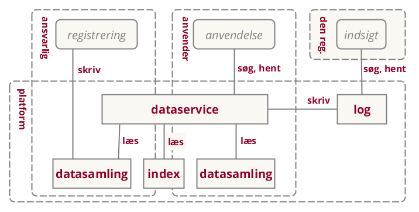
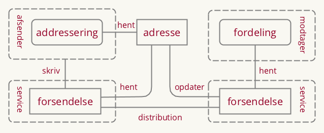

# Fællesoffentlig referencearkitektur for deling af data og dokumenter
_Version 0.1, september 2017._

# Introduktion

Denne version udgør synopsis for det videre arbejde med en referencearkitektur.

Formålet er at konkretisere et muligt indhold med henblik på udpegning af interessenter samt at afgrænse opgaven i forhold til øvrige aktiviteter.

Synopsis vil, på kortest mulige form, give et overblik over strukturen og indholdet af den endelige arkitektur. Synopsen er ikke et gennemarbejdet bud på den endelige løsning, men skal udtale sig om retning og afprøve rammerne for det videre arbejde.

Synopsis følger skabelon for referencearkitekturer som udarbejdet i DIGST/KDA.

## Formål
Referencearkitekturen understøtter anvendelse og udviklingen af offentlige it-systemer, der

- (gen)anvender oplysninger i form af data og dokumenter til sagsbehandling eller selvbetjening
- sender eller modtager meddelelser fra andre it-systemer

## Scope

Referencearkitekturen beskriver anvendelse af og udvikling af it-systemer, der reguleres af blandt andet:

EU databeskyttelse
 ~ *lov* som beskriver pligter og rettigheder ved behandling af persondata

EU eIDAS
 ~ *lov* som definerer registrede tillidstjenester

Persondata lov
 ~ *lov* som beskriver pligter og rettigheder ved behandling af persondata

Lov om Digital Post
 ~ *lov* der gør det obligatorisk for virksomheder og borgere at modtage digitale meddelelser fra offentlige afsendere.

Referencearkitekturen skrives på baggrund af den fællesoffentlige digitaliseringsstrategi 2020 under initiativ 8.1 med tilslutning fra
FM, UFM, EVM, SIM, JM, EFKM, MBUL, SÆM, SKM, MFVM, BM, KL og Danske Regioner. Heri beskrives referencearkitekturen således:

> For at operationalisere, hvilke krav hvidbogen konkret stiller til initiativer og systemer udarbejdes en referencearkitektur for deling af data og dokumenter, der blandt andet beskriver fælles behovsmønstre og mønstre for teknisk understøttelse, herunder de forskelige roller, der skal afklares i initiativerne. Referencearkitekturen udpeger også eventuelle områder for eksisterende og nye fælles standarder og infrastruktur, som skal lette initiativernes implementering. Referencearkitekturen bliver således en generel ramme og støtte for alle initiativernes egen specifikke arkitektur.

Uden for scope:

- åbne data, der ikke kræver adgangskontrol
- registrering og anvendelse af data hos registerejer

## Centrale begreber
I det efterfølgende vil begrebet data blive brugt til at betegne både oplysninger på dokumentform og oplysninger der optræder i registre. Vi anvender begrebet datasamling både om et register og et repository med dokumenter.

Vi vil endvidere lave en skelnen mellem:
 - Udstilling af data - typisk via API i system-til-system-integrationer
 - Forsendelse af meddelelser indeholdende data (eller dokumenter) - typisk brugt ved beskeder til borgere/virksomheder, der skal have retsvirkning, men også et klassisk mønster brugt i system-til-system-integrationer.

 TODO: Indsæt figur.

## Anvendelse
Referencearkitekturen skal:

- danne et fælles sprog til at formulere en fælles handlingsplan
- bruges som reference ved løsningsbeskrivelser

## Tilblivelse og governance
Første udgave er skrevet hos Kontor for Data og Arkitektur af Mads Hjorth, Digitaliseringsstyrelsen og Anders Fausbøll, Omnium Improvement.

Endelig godkendelse forventes hos Styregruppe for Data og Arkitektur under Digitaliseringsstrategien 18. december 2017.

## Metoderamme
Skrives inden for rammerne af Fællesoffentlige Digital Arkitektur, det vil sige; erfaringer fra OIO referencearkitektur, EIRA, TOGAF, ArchiMate.

## Relation til andre referencearkitekturer
Gør brug af

- Fællesoffentlig referencearkitektur for brugerstyring

Skal kunne anvendes af:

- Fællesoffentlig referencearkitektur for selvbetjening
- Fællesoffentlig referencearkitektur for overblik over egne sager og ydelser

Skal anvendes i kontekst sammen med:

- Deling af dokumenter på sundhedsområdet
- Indberetning til registre på sundhedsområdet
- Sag- og dokument på det kommunale område

# Strategi

Udarbejdelsen af referencearkitekturen tager udgangspunkt i en række identificerede forretningsmæssige og teknologiske trends og tendenser.

## Forretningsmæssige tendenser

- Ensretning og nationale indsatser 
MBK: <Hvad menes med ensretning?>
- Data har øget værdi for organisationer
- Øget bevågenhed omkring beskyttelse af privatliv
- Øget opmærksomhed om håndtering af personlige oplysninger
- Mængden af oplysninger der håndteres stiger
- Grænseoverskridende services

## Teknologiske tendenser
- øget central standardisering af begreber, datamodeller og grænseflader
- Flere og mere forskelligartede enheder forbundet til netværket
- Øgede forventninger til brugervenlighed af offentlige digitale services
- Mængden af tilgængelige oplysninger vokser
- Arkitekturvision for anvendelse og udstilling
- Integrated Service Delivery
- ”Interoperability/Samarbejdende infrastrukturer / Økosystem af fælles løsninger?”
- ”Valgfrihed for anvender mellem flere tekniske udbydere af samme oplysninger”

## Strategiske målsætninger
[TODO beskriv målsætninger i eksisterende aftaler og strategier, også gerne fra andre områder]: x

Interoperability
  ~  *mål* om sammenhængende services... integrated service delivery

Once-only
  ~  *mål* om at borger og virksomhed kun skal afgive den samme information til det offentlige en gang... (men give lov til genbrug?)

Transperancy
  ~ *mål* om at borgere og virksomheder skal kunne se, hvilke data der findes om dem, og hvor disse data anvendes

Re-use
  ~ *mål* om genbrug af it med henblik på lavere omkostninger

MBK: <savner mål der kobler til visionen om det datadrevne samfund / data som råstof for samfundsudviklingen>
 
## Vision
[TODO fokus på første workshop]: x

> *Data skal være nemme at bruge og svære at misbruge*

> *Byrden i datadeling skal afløftes fra dataejer, hvis den begrænser genbrug*

> *Ensartet datadeling skal understøtte sammenstilling af data og tværgående brug*
MBK: <fælles metoder er måske bedre end ensartet?>
> *Klar governancce omkring beskrivelse af, adgang til og brug af data*

## Værdiskabelse

- Mindre besvær for borger og virksomheder ved brug af digitale services
- Simplere arbejdsgange og mere potentiale for automatisering hos myndigheder [og virksomheder]
- Understøtte transparens og bevare tillid til registre
- Effektiv systemudvikling (begrænse udfaldsrum, opsamle best practice)
MBK: <igen: data som råstof for vækst. Store potentialer for innovation, konkurrencefordele osv>

## Strategiske principper

Forretningsmæssige, Informationsmæssige, Applikationsmæssige og Tekniske principper bag referencearkitekturen:

- F1: Autoritative register med henvisninger til andre registre
- F2: Ansvar for begrænsning af adgang ligger hos registerejer
- I1: Fælles referenceinformationsmodel
- I2: Dokument-princip (attester mv.)?
- A1: Onlineopslag i sagsbehandling og selvbetjening
- A2: Log adgang
- A3: Adgang til og fra internationale registre sker gennem national gateway
- T1: Central fuldmagts-/rettighedsstyring
- T2: Multi-flavour-api

MBK: <savner noget om fælles referencedata (masterdata, grunddata, klassifikationer)>
MBK: <savner noget om muligheder for at berige data (koble flere data omkring fælles objekter)>
MBK: <savner noget om kvalitetssikring af data - som lægger op til fx at kunne falge data med dårlig kvalitet, indmelde 7 forreslå ændring af fejl i data, især i delte masterdata og grunddata>

# Forretning

## Aktører

- Offentlig myndigheder, og virksomheder der handler på vegne af dem.
- Borger og virksomheder

## Opgaver
Referencearkitekturen finder anvendelse i løsningen af alle offentlige opgaver.

 - Borger og virksomhedsvendte selvbetjeningsløsninger
 - Myndigheders sagsbehandling
 - Tværgående analyse, tilsyn, kontrol

## Funktioner
Referencearkitekturen beskriver tre centrale use cases, hvor aktører arbejder sammen i forskellige roller

Udstilling af data og dokumenter
  ~ *collaboration* hvor oplysninger anvendes i en opgave

Forsendelse af meddelelser
  ~ *collaboration* hvor meddelelser sendes uafviseligt

Registrering
    ~ *collaboration* hvor oplysninger bringes på digital form

## Roller

Registrant
  ~ *rolle* som bringer oplysninger på digital form, registrer

Datasubject
  ~ *rolle* som oplysninger handler

Dataanvender
  ~ *rolle* der anvender oplysninger fra et register

Dataejer
  ~ *rolle* som ejer registreringer/data, ansvar for at udarbejde adgangspolitik

Datadistributør
  ~ *rolle* som ejer registreringer/data, ansvar for at udarbejde adgangspolitik
MBK: <samme definition for to roller er ikke så godt. datadistributør er vel ikke en roller der ejer register/data. Det er nok heller ikke denne role der skal udarbejde adgangspolitik, men har ansvar for at håndhæve den der er udarbejdet af dataejer>

Messaging User
  ~ *rolle* som der sender og modtager meddelelser

Messaging Provider
  ~ *rolle* som leverer services til forsendelse

Nogle kan betragtes som specialiseringer af GDPR-rollen Databehandler.

## Tværgående processer
Herunder beskrives, hvor de enkelte business functions hos de enkelte roller anvendes i kontekst af et sæt af generiske procesmønstre.

 - Sagsbehandling (fra Sag og dokument)
 - Simpel selvbetjening (fra Selvbetjening)
 - Tværgående selvbetjening (fra Sammenhængende services)
MBK: <fra Selvbetjening, hvis i snakker om referencearkitektur. Vi har ikke en der hedder sammenhængende services> 
 - Indsigt i oplysninger og deres anvendelse (fra Overblik over sag og ydelser)
 - Sende meddelelse (inkl. brug af tilmeldingslister og påmindelser)
 - Modtage meddelelse
 - Tag et dokument med til en anden service provider, der ikke har adgang til registre - herunder beskrive, hvordan dokumenter valideres.

## Forretningstjenester
Procestrin udtrykkes typisk ved Forretningstjenester, der igen kan realiseres af interne business functions eller trække på eksterne business services.

[TODO]: x "[Vi skal være bedre til at beskrive hvordan vi trækker på elementer fra brugerstyring, men husk at holde det teknologi-fri]"

## Forretningsobjekter
Nedenfor fremgår en initiel oversigt over en række forretningsobjekter, der er væsentlige for referencearkitekturen. Det videre arbejde skal klarlægge, hvilke elementer der skal indgå i listen samt hvordan de defineres. Modelleringsniveauet skal endvidere lægges fast (bregrebsmodellering og/eller logiske kernemodeller?) Kommentarer/regibemærkninger indgår i listen, markeret med kantede parenteser.

Data
  ~ *objekt* (Abstrakt. Bruges om både registerrecord og dokument)

Registeroplysning
  ~ *objekt* en record

Dokument
  ~ *objekt* [Dokumentmodel fra OIO]

Datasamling
  ~ *objekt* [Datasætmodel har ikke noget!] ISO9115: en identificerbar samling af oplysninger (samlebetegnelse for PSI, GPDR, )

Datasubjekt
  ~ *objekt* [Grunddata, fx person]

Model/Schema
  ~ *objekt* [Jf. modelregler fra FDA]

Meddelelse
  ~ *objekt* [Næste generation Digital Post]

Påmindelse
  ~ *objekt* [Næste generation Digital Post]

Registreringshændelse
  ~ *objekt* [Datafordeler]

MBK: <Liste og model matcher ikke helt>
MBK: <savner Dataservice, Forretningshændelse, Klassifikation>
MBK: <Der bør være noget om sammenhængen mellem Referenceinformationsmodel, Applikationsprofiler og Snitfaldespecifikationer (inkl operationer og format)
MBK: <Noget om anonymiserede data. Evt. kandidat til standardiseret metode>
 
## Forretningsmønstre?

Rambøll nævner:

- Samtale -> forsendelse
- Udsende, hente -> forsendelse? udstilling?
- Indberetning -> registrering
- Udsende eller hente med svarforventning -> forsendelse?
- Abonnement -> ekstra service ved udstilling
- Proceskæde med afhængigheder -> forsendelse mellem processer

KL nævner i rammearkitekturen:

- Kald integration -> udstilling
- Hændelsesbeskedintegration -> ekstra service ved udstilling
- Meddelelsesbesked integration -> forsendelse
- Dialogintegration -> udstilling?

# Teknisk arkitektur
Dette afsnit beskriver de væsentligste komponenter og services, der skal indgå i en løsningsarkitektur for deling af data og dokumenter. TODO: Færdiggør indledning.

Forretningsfunktionerne understøttes/realiseres af applikationer.

## Applikationsroller

eDelivery Service Provider
  ~ *applikationsservice* som skal kunne:

- udstille eller levere meddelelser til modtager
- modtage og distribuere meddeleleser
- fortælle andre om deres kunder

Dataservice
  ~ *applikationsservice* som skal kunne:

- opbevare datasamling
- begrænse adgang til de rigtige
- (måske) vedligeholde og udsende abonnementer
MBK: <vel også udstille / dele, understøtte fremsøgning, udtræk og evt yderligere operationer, som fejl rette, flage fejl o.l.>

Kontaktregister
  ~ *applikationsservice* som er en slags data service med en særlig type oplysninger

Log
  ~ *applikationsservice* som er en slags data service med særlige oplysninger

Indeks
  ~ *applikationsservice* som er en slags data service med særlige oplysninger. Kan undværes, men på kraftig bekostning af effektivitet i bestemte situationer.

Katalog
  ~ *applikationsservice* som ikke er en dataservice, fordi der ikke er begrænset adgang. Kan undværes, men ikke effektivt.
MBK: >Forstår ikke denne defintion. For mig er hverken et katalog eller en dataservice defineret ved adgangsrettigheder. Et katalog skal fx også kunne begrænse adgang og en dataservice skal også kunne tilbyde adgang til læs . søg, hent / download uden login hvis der er tale om åbne data uden rettighedsbegrænsninger.>

MBK: <Savner byggeblokke som fx Klassifikationsservices (både udstille klassifikationer og mapninger), Serviceregister, Systemkatalog, datakatalog, Modelkatalog.>

[TODO Skal vi have en "beskyttet dataservice" og en offentlig?]: x
MBK:<Det mener jeg er et must, jf hele open data agendaen>

## Tekniske Implementeringer
Her grupperes de enkelte roller og applikationsroller jf. forskellige mønstre.

### Dataanvendelse

Når en dataanvender (virksomheder eller myndigheder) vil have adgang til data hos en myndighed, er der et par relevante mønstre: (TODO: Overvej samtykker ift. Virksomhed)

#### Direkte adgang, SOA

TODO: Tilføj beskrivelse
MBK: SOA bruges ikkekun til direkte adgang, men kan også være via proxy, som fx datafordeleren, der jo også tilbyder SOA-services af forskellig flavour.
MBK:<Der bør være noget om flavours af SOA: EDA, LD. og om SOAP vs REST. Plus vel også koblingen til AS"/AS4 når vi snakker protokoller>
MBK: Måske ikke det rette sted for denne kommentar, men vi bør også komme omkring Linked data og Block Chain i et afsnit om teknologitrends.
MBK: <Der bør også være noget om synkron vs asynkron og om fil/batch mønster>

#### Datadistribution

TODO: Tilføj beskrivelse (sammenstilling samt adgangskontrol og logning)

#### Distribueret Service- og data-platform

TODO: Tilføj beskrivelse

### Registreret forsendelse

Når en myndighed vil sende noget til en myndighed, virksomhed eller borger.

#### Sikker email

MBK: <Dette mener jeg vi bør forsøge at lægge uden for scope ifht at deling er vores hoedfokus>

#### Fælles system

fx e-Boks. Analogi til varder el. postbokskontor. Kan aftales bilateralt, inden for domæner m.m.

#### Service Providers

kan være både generisk eller specifikt for et domæne.

### Registrering*

Registrering af data er ikke i scope for denne referencearkitektur, men medtages kort pga. sin væsentlige relation til Index-konceptet.

Ansvar hos registrant
  ~ *implementationsmønster*

Ansvar hos dataejer
  ~ *implementationsmønster*

Ansvar hos distributør
  ~ *implementationsmønster*

## Områder for standardisering/profileringer
Nedenstående, tekniske områder er kandidater til at indgå i referencearkitekturen i forhold til at pege på en anbefalet standard eller en særlig profilering, evt. vendt mod de enkelte, tekniske mønstre.

- Service Design Guidelines
- Access Protocols
- Distribution Protocols
- Synchronisation Protocols
- Metadata for opslag/søgning/anvendelse
- Log format
- Identifikation
- Klassifikation af følsomhed
- Klassifikation af anvendelse (sagsbehandling vs analyse)
- Hændelsesbeskeder
- Protokol for flytning af filer, kryptering
- Hjemmel (samtykke, lov)
- Context

MBK:<Web service beskrivelser er også et vigtigt emne. Fx en udvidelse af WSDL, så det understøtter Linked data. tal med Peter bruhn om dette.>
MBK: <Fælles liste over standard operationer og vejledning i hvordan de inarbedes ifbm med udarbejdelse af snitfladespecifikationer>
## Identifikation af eksisterende standarder
